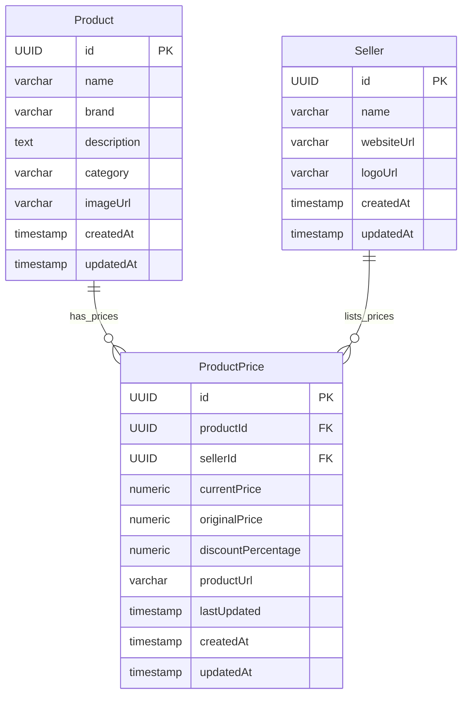

# PricePilot Architecture Overview

PricePilot follows a clean, layered architecture designed for separation of concerns, scalability, and ease of maintainability.

---

## 1. High-Level System Architecture

The project consists of three primary tiers:

```
┌────────────────────────────────────────────────────────┐
│                   Client Browser                       │
│  - Executes React UI & Framer Motion animations        │
│  - Communicates with API via Axios (using localhost)   │
└──────────────────────────┬─────────────────────────────┘
                           │
                           │ HTTP/REST (Port 80/8080)
                           ▼
┌────────────────────────────────────────────────────────┐
│             Nginx Frontend Container (Port 80)          │
│  - Serves static compiled React & HTML/CSS/JS assets   │
│  - Custom routing resolves paths to index.html         │
└──────────────────────────┬─────────────────────────────┘
                           │
                           │ Internal Network API Calls
                           ▼
┌────────────────────────────────────────────────────────┐
│          Spring Boot Backend Container (Port 8080)     │
│  - Active Profile: Prod (Java 25 runtime environment)  │
│  - Manages REST endpoints, mappings, validations       │
└──────────────────────────┬─────────────────────────────┘
                           │
                           │ PostgreSQL TCP (Port 5432)
                           ▼
┌────────────────────────────────────────────────────────┐
│            PostgreSQL DB Container (Port 5432)         │
│  - Persistent Volume: postgres_data                    │
│  - Source of truth for products, sellers, and prices  │
└────────────────────────────────────────────────────────┘
```

---

## 2. Backend Design Patterns

The backend code is organized into feature-driven packages and strictly implements the standard **Controller → Service → Repository** model:

```
User Request ──> Controller ──> Service ──> Repository ──> PostgreSQL
      DTO <── Response DTO <── Service <── JPA Entity <── Database
```

### Layer Responsibilities
1. **Controller Layer (REST Endpoints):**
   * Exposes endpoints (e.g. `ProductController`, `SellerController`).
   * Handles HTTP routing, input validation (`jakarta.validation.Valid`), and CORS headers (`@CrossOrigin(origins = "*")`).
   * **Rule:** Controllers never communicate with the database directly. They accept Request DTOs and return Response DTOs.
2. **Service Layer (Business Logic):**
   * Encapsulates core algorithms (e.g. `ProductService`, `ProductPriceService`).
   * Computes price comparisons, discount amounts, and discount percentages.
   * Handles transactional boundaries (`@Transactional`).
   * Maps database entities to DTOs.
   * **Rule:** Services orchestrate domain updates and use repositories to read/write database state.
3. **Repository Layer (Data Access):**
   * Declares interfaces (e.g. `ProductRepository`, `ProductPriceRepository`) extending `JpaRepository`.
   * Implements custom queries (JPQL or Specifications) for multi-faceted filters and sorting.
   * **Rule:** Isolated to SQL execution and Hibernate translation.

---

## 3. Database Schema & Domain Relationships

The data model connects products to multiple competing sellers via the price record:



* **One-to-Many Relationships:**
  * One `Product` has many `ProductPrice` entries.
  * One `Seller` has many `ProductPrice` entries.
* **Many-to-One Relationships:**
  * `ProductPrice` references exactly one `Product` and one `Seller`.

---

## 4. Frontend Architecture

The frontend is a lightweight Single Page Application (SPA) built on React 19, TypeScript, and Vite 8:
* **Tailwind CSS v4:** Handles all modern styling, utilizing utility classes.
* **Framer Motion:** Power-packs high-end responsive animations and micro-interactions for a premium feel.
* **Lucide Icons:** Provides standard high-quality system icons.
* **Axios API Client:** Coordinates JSON data fetch requests from the backend API.
* **Environment variables:** Resolves `import.meta.env.VITE_API_BASE_URL` to route requests to the container-exposed backend.

---

## 5. Deployment Orchestration

* **Health Orchestration:** Prevents the backend from starting before the database is ready, and prevents the frontend from starting before the backend is ready.
* **Docker Network:** All three services communicate on a private bridge network (`pricepilot-network`). Only backend and frontend ports are exposed to the host machine for safety.
* **Data Volume:** Persists PostgreSQL records across container restarts (`postgres_data`).