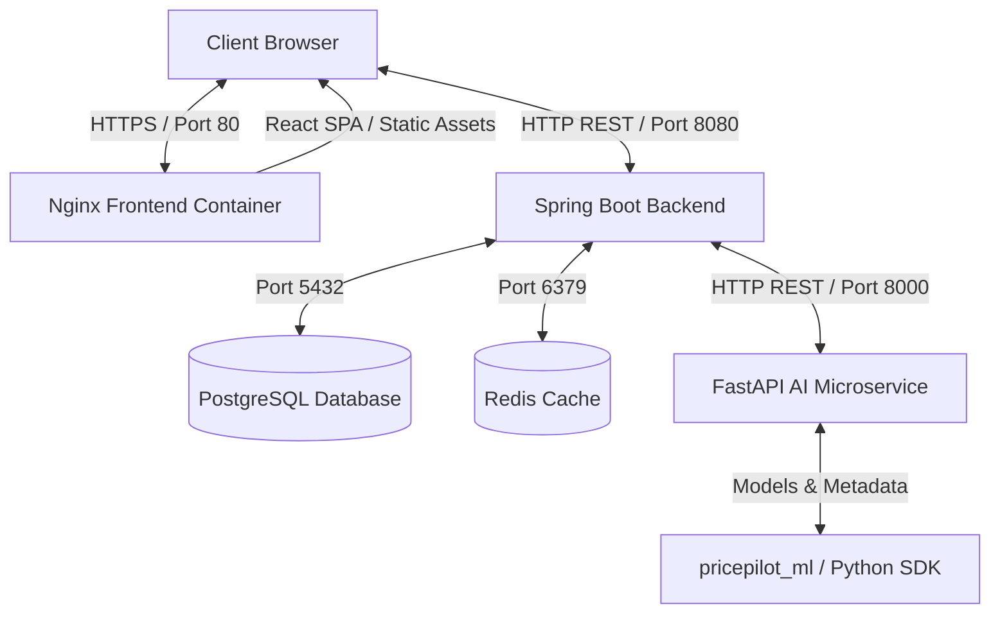
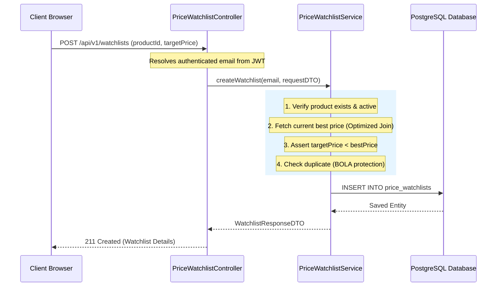

# ✈️ PricePilot

<div align="center">
  <p align="center">
    <strong>A high-performance, intelligent price comparison search engine with real-time analytics, an AI shopping assistant, and hybrid machine learning recommendations.</strong>
  </p>

  <p align="center">
    <a href="https://github.com/jadhavaayush611/Price-Pilot/actions"></a>
    <a href="LICENSE"></a>
    <a href="https://sonarcloud.io/"></a>
    <a href="https://adoptium.net/"></a>
    <a href="https://www.python.org/"></a>
    <a href="https://react.dev/"></a>
  </p>
</div>

---

PricePilot is a modern, production-grade price comparison engine designed to compile, standardize, and track product pricing across multiple online retailers. It highlights the best available discounts, tracks historical price fluctuations, provides personalized recommendations via a hybrid machine learning pipeline, and includes an intelligent AI Shopping Assistant chatbot.

---

## 🌟 Key Features

### 💻 Frontend Experience
- **React 19 & Vite 8 SPA**: Single Page Application leveraging fast loading and modern hooks.
- **Framer Motion Micro-Interactions**: Premium animations, hover effects, and page transitions.
- **Tailwind CSS v4 & Shadcn UI**: Clean, modular, and responsive design with dark mode support.
- **Interactive Price History Charts**: Visual timelines showing retail price fluctuations over time.

### ⚡ Backend REST API
- **Spring Boot 4.1.0 (Java 21)**: Highly performant, layered (Controller-Service-Repository) architecture.
- **Spring Data JPA & Hibernate 7.x**: Optimized object-relational mapping.
- **Flyway Migrations**: Clean database versioning and schema evolution.
- **Observability**: Spring Boot Actuator endpoints feeding metrics directly to Prometheus.

### 🧠 AI & LLM Copilot
- **FastAPI AI Service**: Secure Python-based microservice interacting with OpenAI LLMs.
- **Conversation Isolation**: Scoped chat memory using user email prefixes to prevent IDOR vulnerabilities.
- **Prompt Injection Defense**: Structurally isolated inputs using XML boundary tags.
- **Hot-Reloadable Models**: Secure machine learning model hot reloading protected by security tokens.

### 📊 Recommendation & ML
- **Hybrid Recommendation Engine**: Combines User Collaborative Filtering and Content-Based Filtering.
- **Personalized Dashboard**: Real-time stats showing active watchlists, price alert status, and recommendations.
- **Training ETL Pipeline**: Independent Python training pipelines with exportable serialized weights (`.pkl`).

### 📦 Python SDK
- **Type-safe Client**: Fully type-hinted Python SDK mapping the complete backend REST namespace.
- **Resilient Networking**: Connection pooling, configurable timeouts, and exponential backoff retries.

### 🛡️ Security Hardening
- **Stateless JWT Security**: Spring Security pipeline checking user status on every incoming request.
- **BOLA / IDOR Prevention**: Ownership validation matching active user context to DB query filters.
- **Safe Redis Serialization**: whitelisted deserialization classes to prevent Remote Code Execution (RCE).
- **Configurable Rate Limiting**: Token-bucket rate limiting applied to auth, recommendations, and AI endpoints.

---

## 📐 System Architecture

PricePilot follows a decoupled, microservice-based architecture orchestrating React, Spring Boot, FastAPI, Redis, and PostgreSQL.



### Request Flow Lifecycle (Product Watchlist Creation)


---

## 🛠️ Technology Stack

| Tier | Technology | Version | Purpose |
| :--- | :--- | :--- | :--- |
| **Frontend** | React | `19.2` | Client SPA interface |
| | Vite | `8.0` | Build tool and bundler |
| | Tailwind CSS | `4.3` | Utility styling engine |
| | Framer Motion | `12.4` | Smooth transitions & animations |
| **Backend** | Spring Boot | `4.1.0` | Core REST API framework |
| | Java JDK | `21` | Runtime standard |
| | Hibernate | `7.x` | Object-Relational Mapper |
| | Flyway | `9.x` | Database migrations |
| **Cache & DB**| PostgreSQL | `15` | Persistent source of truth |
| | Redis | `7` | Query caching & Rate limiting |
| **AI / ML** | FastAPI | `0.110` | Python AI gateway |
| | Python | `3.11` | ML training & SDK executions |
| | scikit-learn | `1.4` | Collaborative & Content algorithms |

---

## 📖 Documentation Index

For detailed instructions on setup, development, and system design, explore our dedicated guides:

- 💾 **[Installation Guide](docs/INSTALLATION.md)**: Manual setup for local development (JDK 21, Python, Node.js, PostgreSQL).
- 🚢 **[Deployment Guide](docs/DEPLOYMENT.md)**: Containerized deployment using Docker Compose, network structure, and environment configuration.
- 🔌 **[API Documentation](docs/API_DOCUMENTATION.md)**: End-to-end REST API specifications, payload schemas, and response formats.
- 🛡️ **[Security Policy](SECURITY.md)**: Deep dive into PricePilot's security model, IDOR protections, and safe serialization.
- 📐 **[Database & Domain Architecture](docs/ARCHITECTURE.md)**: Backend architectural patterns, entities, and ER diagrams.
- 🧠 **[AI Assistant Architecture](docs/AI_ASSISTANT_ARCHITECTURE.md)**: Details on the LLM chatbot integrations, uvicorn configurations, and memory isolation.
- ⚡ **[FastAPI Core Services](docs/FASTAPI_AI_ARCHITECTURE.md)**: Endpoint structures and performance auditing for the AI service.
- 📊 **[ML Recommendation Engine](docs/ML_RECOMMENDATION_ENGINE.md)**: Math and algorithms driving collaborative/content recommendation filters.
- 💾 **[Data Ingestion Pipeline](docs/DATA_PIPELINE.md)**: Schema structures, mock records, and CSV dataset seeding processes.
- 🚀 **[Production Readiness](docs/PRODUCTION_READINESS.md)**: Scalability reviews, performance metrics, and pre-release audits.
- 📝 **[Architectural Decisions](docs/DECISIONS.md)**: Record of core structural and technology choices (ADRs).

---

## 🚀 Quick Start with Docker

Launch the complete PricePilot system (Database, Redis, AI Service, Spring Boot Backend, and Nginx Frontend) with a single command:

```bash
docker compose up --build -d
```

### Access Points
* 🖥️ **Frontend UI**: `http://localhost/`
* 🔌 **Backend API Gateway**: `http://localhost:8080/api/v1`
* 🩺 **Backend Health Actuator**: `http://localhost:8080/actuator/health`
* 🧠 **AI Service Health**: `http://localhost:8000/health/readiness` (exposed locally)

For detailed manual instructions without Docker, refer to the [Installation Guide](docs/INSTALLATION.md).

---

## 📦 Python SDK Quick Start

PricePilot includes a production-grade, type-safe Python SDK under `/pricepilot-python-sdk`.

```python
from pricepilot import PricePilotClient

# Initialize Client
client = PricePilotClient(base_url="http://localhost:8080/api/v1")

# Authenticate
client.auth.login(email="user@example.com", password="password123")

# Search products
results = client.products.search(keyword="headphones", category="Electronics")
for product in results.content:
    print(f"{product.name} | Lowest Price: ${product.lowest_price}")
```
See the [SDK Guide](pricepilot-python-sdk/README.md) for detailed code examples.

---

## 🗺️ Roadmap & Future Plans

- [x] Stateless JWT security pipeline with database status checks.
- [x] Decoupled uvicorn FastAPI AI gateway with XML shielding.
- [x] Comprehensive Type-Safe Python SDK.
- [ ] **Asynchronous Alerting Gateway**: RabbitMQ messaging queue to process notifications.
- [ ] **Vector Database Migration**: Transitioning recommendation rankings from in-memory to pgvector.
- [ ] **Distributed Scraping Clusters**: Scrapy crawler service to update prices automatically.

---

## 🤝 Contributing

We welcome contributions! Please review our **[Contributing Guidelines](CONTRIBUTING.md)** and **[Code of Conduct](CODE_OF_CONDUCT.md)** before opening pull requests or creating issues.