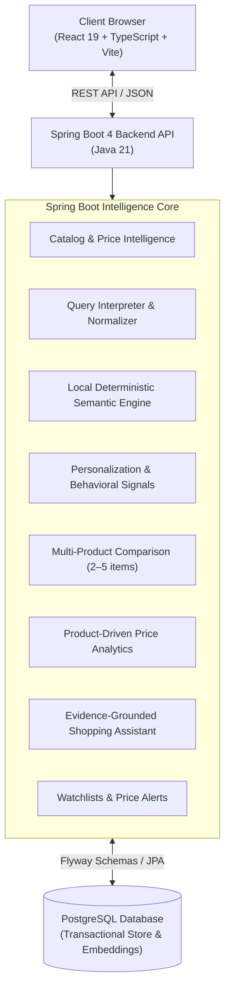
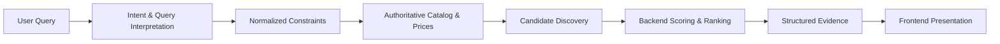

<div align="center">

# PricePilot

### Shopping intelligence for better buying decisions

<p align="center">
  <strong>Understand the price. Compare the options. Personalize the decision. Know when to buy.</strong>
</p>

<p align="center">
  <a href="https://github.com/jadhavaayush611/Price-Pilot/releases/tag/v1.2.0"></a>
  <a href="LICENSE"></a>
  <a href="https://adoptium.net/"></a>
  <a href="https://spring.io/projects/spring-boot"></a>
  <a href="https://react.dev/"></a>
  <a href="https://www.typescriptlang.org/"></a>
  <a href="https://tailwindcss.com/"></a>
  <a href="https://www.postgresql.org/"></a>
</p>

</div>

---

**PricePilot** is shopping intelligence that helps users understand prices, compare products, personalize decisions, and know when to buy.

Most commerce platforms focus solely on raw catalog listings and basic price points. PricePilot bridges the gap between raw data and shopping decisions by combining natural-language intent parsing, deterministic semantic discovery, multi-product comparison matrices, and evidence-grounded conversational assistance into a single unified platform.

---

## The Product Story: Beyond Price Comparison

Traditional e-commerce tools answer one basic question: *"What is the price?"*

PricePilot expands this into an end-to-end decision journey:

```
What is the price?
        ↓
Which product is better?
        ↓
Which product is better for me?
        ↓
Where should I buy it?
        ↓
When should I buy it?
```

With the **v1.2 release**, PricePilot transitions from price comparison toward full shopping decision support. Instead of simply aggregating numerical prices, the system evaluates seller reliability, historical trends, explicit user preferences, and behavioral signals to help shoppers make well-informed buying decisions with confidence.

---

## Core Capabilities

### 🔍 Natural-Language Shopping Discovery
PricePilot interprets conversational, unstructured buyer intent into structured catalog constraints before executing authoritative search queries:
* *"wireless headphones under ₹5000"* &rarr; Extracts category (`Headphones`), technology (`Wireless`), and maximum price ceiling (`5000 INR` canonicalized to `USD`).
* *"noise cancelling headphones for bass-heavy music"* &rarr; Extracts audio feature constraints, category, and acoustic profile preferences.
* *"laptop with good battery life"* &rarr; Extracts computing category, hardware attributes, and battery endurance signals.

Queries are parsed deterministically, preserving user intent without external LLM dependencies.

### ⚖️ Side-by-Side Product Comparison
* **2–5 Products**: Compare two to five catalog items simultaneously in a structured, responsive matrix.
* **Authoritative Evidence**: Real catalog specifications, current seller offers, ratings, and price history metrics side by side.
* **Objective Scoring**: Transparent score breakdowns highlighting clear category winners, feature trade-offs, and value leaders.

### 🎯 Personalization & Behavioral Context
* **Explicit Preferences**: Customize preferred brands, strict budget ranges, primary shopping priorities (e.g., lowest price, highest rating, seller trust), and default display currency.
* **Behavioral Context**: Tracks user view interactions, search queries, and engagement signals to refine discovery and recommendations.
* **Smart Alternatives**: Recommends similar products when an item is out of stock, overpriced, or lacks verified sellers.

### 📈 Price Intelligence & Trajectory Tracking
* **Multi-Seller Tracking**: Real-time comparison across active merchants, highlighting verified lowest prices.
* **Historical Fluctuations**: Interactive visual timelines tracking pricing shifts across days, weeks, and months.
* **Deal & Timing Signals**: Automated classification of deal quality (Great Deal, Fair, Above Average) with actionable buy/wait signals.

### 🤖 Evidence-Grounded Shopping Assistant
* **Grounded in Truth**: The conversational assistant reasons strictly over verified catalog items, live merchant pricing, and active user preferences.
* **Zero Hallucinations**: Rejects speculative claims; if data is missing or incomplete, the assistant explicitly reports data boundaries.
* **Deterministic Fallback**: Provides instant, coherent shopping guidance and trade-off summaries without requiring third-party hosted AI APIs.

### 🔔 Watchlists & Price Alerts
* **Target Price Monitoring**: Set custom target thresholds on catalog items.
* **Automated Alert Eligibility**: Backend validates target price sanity against historical and current best prices to prevent redundant alerts.
* **Saved Products**: Quick-access collection of monitored items with live price status badges.

### 🌐 Deterministic Multi-Currency Engine
* **Canonical Internal Currency**: All product prices, historical records, and comparison computations use **USD** as the internal source of truth.
* **User-Facing Display**: Centralized, real-time conversion into **INR**, **USD**, **EUR**, **GBP**, and **JPY** at input and presentation boundaries.
* **Consistent Scoring**: Internal sorting and ranking remain mathematically invariant regardless of the selected display currency.

---

## v1.2 — AI Shopping Companion

The **v1.2** release introduces major enhancements across intelligence, decision tooling, and consumer experience:

| Domain | Enhancements |
| :--- | :--- |
| **Intelligence** | • Natural-language query interpretation with constraint extraction<br/>• Local deterministic semantic embeddings and vector search<br/>• Multi-attribute personalization engine factoring explicit preferences & behavioral context<br/>• Transparent recommendation reasoning with structured trade-off analysis<br/>• Evidence-grounded conversational Shopping Assistant |
| **Decision Tools** | • Side-by-side comparison matrix supporting 2 to 5 products<br/>• Product-driven analytics showing historical trends, volatility, and timing recommendations<br/>• Proactive price alert thresholds and saved product tracking<br/>• Centralized multi-currency conversion across all consumer touchpoints |
| **Product Experience** | • Ambient visual cursor interaction and fluid responsive layout<br/>• Refined consumer navigation with immediate access to discovery, assistant, and analytics<br/>• Real verified product imagery with graceful placeholder fallbacks<br/>• Clear, human-centric copy focusing on buyer confidence |

---

## Architecture & System Design

PricePilot is built as a modular monolith where the backend serves as the single authoritative source of truth. The frontend never independently computes ranking scores, eligibility, or monetary transformations.


```mermaid
graph TD
    Client["Client Browser<br/>(React 19 + TypeScript + Vite)"]
    API["Spring Boot 4 Backend API<br/>(Java 21)"]
    DB[("PostgreSQL Database<br/>(Transactional Store & Embeddings)")]

    subgraph Backend_Intelligence["Spring Boot Intelligence Core"]
        Catalog["Catalog & Price Intelligence"]
        Query["Query Interpreter & Normalizer"]
        Semantic["Local Deterministic Semantic Engine"]
        Personalization["Personalization & Behavioral Signals"]
        Comparison["Multi-Product Comparison (2–5 items)"]
        Analytics["Product-Driven Price Analytics"]
        Assistant["Evidence-Grounded Shopping Assistant"]
        Watchlist["Watchlists & Price Alerts"]
    end

    Client <-->|REST API / JSON| API
    API --> Backend_Intelligence
    Backend_Intelligence <-->|Flyway Schemas / JPA| DB
```

> **Core Principle**: Structured backend evidence is the source of truth. Semantic and conversational systems consume that evidence; they do not replace it.

### End-to-End Request Lifecycle


```mermaid
flowchart LR
    A["User Query"] --> B["Intent & Query Interpretation"]
    B --> C["Normalized Constraints"]
    C --> D["Authoritative Catalog & Prices"]
    D --> E["Candidate Discovery"]
    E --> F["Backend Scoring & Ranking"]
    F --> G["Structured Evidence"]
    G --> H["Frontend Presentation"]
```

1. **User Query**: Shopper enters a natural-language search or assistant prompt.
2. **Intent & Interpretation**: Backend parses brands, price ceilings, features, and intent without hallucination.
3. **Normalized Constraints**: Parameters are normalized into canonical USD bounds and structured filter criteria.
4. **Authoritative Retrieval**: Catalog and pricing repositories query validated PostgreSQL records.
5. **Candidate Discovery**: Semantic and keyword search surfaces relevant product candidates.
6. **Scoring & Ranking**: Multi-factor ranking evaluates price competitiveness, rating, seller trust, and user preferences.
7. **Structured Evidence**: A verified evidence bundle is assembled containing product facts, price trends, and trade-offs.
8. **Frontend Presentation**: The client renders visual cards, comparison tables, or assistant responses.

---

## Technology Stack

| Layer | Technology | Version | Purpose |
| :--- | :--- | :--- | :--- |
| **Frontend** | React | 19.2 | Modern Single Page Application interface |
| | TypeScript | 6.0 | End-to-end type safety and contract enforcement |
| | Vite | 8.1 | High-speed build tooling and local development server |
| | Tailwind CSS | 4.3 | Responsive utility styling and dark aesthetic |
| | Framer Motion | 12.4 | Micro-interactions, transitions, and ambient motion |
| | TanStack Query | 5.101 | Server state management and optimistic caching |
| | Lucide React | 1.25 | Clean, accessible iconography |
| **Backend** | Spring Boot | 4.1.0 | Layered enterprise REST API framework |
| | Java JDK | 21 LTS | Modern Java runtime standard |
| | Spring Data JPA | 4.x | Object-relational mapping and repository abstraction |
| | Spring Security | 7.1 | Stateless JWT authentication and route authorization |
| | JJWT | 0.12.6 | Cryptographic JSON Web Token handling |
| | Flyway | 9.x | Database schema versioning and deterministic migrations |
| | Micrometer | 1.x | Application metrics and runtime health probes |
| **Database** | PostgreSQL | 15+ | Relational persistence, full-text indexes, and vector storage |
| **Containers** | Docker | Latest | Multi-stage, non-root production container builds |

---

## Engineering Principles

* **Backend-Owned Intelligence**: All authoritative ranking, scoring algorithms, deal evaluations, and monetary interpretations reside exclusively in the backend service. The client acts as a pure presentation layer.
* **Canonical Money Model**: All prices and thresholds are persisted and computed in USD. User-selected currencies (`INR`, `USD`, `EUR`, `GBP`, `JPY`) are converted deterministically at the API presentation boundary.
* **Deterministic & Self-Contained Operation**: Core shopping discovery, semantic embedding, and assistant features function independently without requiring third-party hosted LLM API keys or proprietary vector databases.
* **Evidence-Grounded Assistant**: The Shopping Assistant constructs responses strictly from verified repository evidence. If information is unavailable, it explicitly communicates the data boundary rather than inventing details.
* **Safe Degradation**: Products without verified, high-quality images render clean, accessible fallback placeholders, ensuring visual consistency across all viewports.

---

## Project Structure

```
Price-Pilot/
├── backend/                       # Spring Boot 4 REST API application
│   ├── src/main/java/com/pricepilot/
│   │   ├── intelligence/          # Assistant, comparison, discovery, personalization, semantic
│   │   ├── currency/              # Canonical USD model & multi-currency conversion
│   │   ├── product/               # Product catalog & search specifications
│   │   ├── productprice/          # Seller prices & current best offers
│   │   ├── pricehistory/          # Price history records & trend tracking
│   │   ├── watchlist/             # Target price alerts & watchlist management
│   │   ├── user/                  # User accounts and profile management
│   │   └── security/              # Stateless JWT authentication & authorization
│   └── src/main/resources/
│       ├── db/migration/          # Flyway SQL migrations (V1.0 through V1.18)
│       └── application*.properties# Environment configurations
├── frontend/                      # React 19 + TypeScript + Vite SPA
│   ├── src/
│   │   ├── components/            # Layout, comparison tables, ambient visuals, image fallbacks
│   │   ├── context/               # Authentication and global state
│   │   ├── currency/              # Currency context, formatting, and conversion helpers
│   │   ├── pages/                 # Discovery, Assistant, Comparison, Analytics, Watchlists
│   │   └── services/              # Axios API clients
│   └── package.json               # Frontend dependencies & scripts
├── docs/                          # Architecture guides, subsystem specs, and ADRs
├── docker-compose.yml             # Reference container orchestration
├── CONTRIBUTING.md                # Contribution workflow and guidelines
├── CODE_OF_CONDUCT.md            # Community code of conduct
├── SECURITY.md                    # Security policy and disclosure process
├── LICENSE                        # MIT License
└── README.md                      # Public project documentation
```

---

## Getting Started

### Prerequisites
* **Java Development Kit (JDK) 21 LTS** ([Eclipse Temurin](https://adoptium.net/) recommended)
* **Node.js 20+** and **npm**
* **PostgreSQL 15+** running locally (or reachable remotely)

---

### Backend Setup

1. Navigate to the backend directory:
   ```bash
   cd backend
   ```
2. Build the application and run unit/integration tests:
   * **Linux / macOS**:
     ```bash
     ./mvnw clean install
     ```
   * **Windows**:
     ```powershell
     .\mvnw.cmd clean install
     ```
3. Start the Spring Boot backend:
   * **Linux / macOS**:
     ```bash
     ./mvnw spring-boot:run
     ```
   * **Windows**:
     ```powershell
     .\mvnw.cmd spring-boot:run
     ```
   The backend API will be available at `http://localhost:8080/api/v1`.

---

### Frontend Setup

1. Navigate to the frontend directory:
   ```bash
   cd frontend
   ```
2. Install dependencies:
   ```bash
   npm install
   ```
3. Launch the development server:
   ```bash
   npm run dev
   ```
   The frontend application will start at `http://localhost:5173/`.

---

### Running Tests

* **Backend Tests**:
  ```bash
  cd backend
  ./mvnw test
  ```
* **Frontend Tests**:
  ```bash
  cd frontend
  npm test
  ```
* **Frontend Production Build**:
  ```bash
  cd frontend
  npm run build
  ```

---

### Docker Deployment

PricePilot provides an enterprise multi-stage Dockerfile for the backend service (`backend/Dockerfile`), utilizing an unprivileged non-root user (`appuser:appgroup`) on `eclipse-temurin:21-jre`.

To build and run the backend container:
```bash
docker build -t pricepilot-backend backend/
docker run -p 8080:8080 \
  -e SPRING_PROFILES_ACTIVE=dev \
  pricepilot-backend
```

> [!NOTE]
> The repository includes a `docker-compose.yml` for multi-service local testing. In modern v1.2 environments, the backend operates independently with PostgreSQL, with optional caching and containerized frontend serving.

---

## Configuration

The application is configured via environment variables or Spring profile configuration files (`application-dev.properties`, `application-prod.properties`).

| Variable | Description | Default / Example |
| :--- | :--- | :--- |
| `SPRING_PROFILES_ACTIVE` | Active Spring Boot configuration profile | `dev` (use `prod` for production) |
| `SPRING_DATASOURCE_URL` | JDBC URL for PostgreSQL database | `jdbc:postgresql://localhost:5432/pricepilot` |
| `SPRING_DATASOURCE_USERNAME` | Database username | `postgres` |
| `SPRING_DATASOURCE_PASSWORD` | Database password | `postgres` |
| `PRICEPILOT_JWT_SECRET` | Base64-encoded secret key for signing JWT tokens | *Must decode to ≥256 bits (32 bytes)* |
| `PRICEPILOT_CORS_ALLOWED_ORIGINS` | Comma-delimited list of allowed CORS origins | `http://localhost:5173,http://localhost:3000` |
| `VITE_API_BASE_URL` | Frontend API client base URL | `http://localhost:8080/api/v1` |

> [!IMPORTANT]
> **JWT Secret Entropy Requirement**: The backend enforces strict cryptographic validation at startup via `@PostConstruct`. The `PRICEPILOT_JWT_SECRET` must be a valid Base64 string decoding to at least **256 bits (32 bytes)** of key material. Providing a weak or under-length key will cause the application context to safely abort initialization.

---

## Verification & Test Status

PricePilot v1.2 maintains comprehensive automated test coverage across both backend and frontend layers:

* **Backend Test Suite**: **778 / 778** tests passing (unit, repository, service, security, and controller slices).
* **Frontend Test Suite**: **162 / 162** tests passing (component, routing, currency, and integration tests).
* **Production Build**: Passing with strict TypeScript type-checking (`tsc -b`) and asset bundling.

---

## Deployment Status

* **Frontend**: Configured for static hosting on **Render Static Site**.
* **Backend**: Containerized web service running via Docker on **Render**.
* **Database**: Managed PostgreSQL hosted on **Supabase**.

> [!NOTE]
> The **v1.2.0 release** is tagged in this repository. Public cloud deployment is currently being finalized.

---

## Product Roadmap

```
v1.0 — Intelligent Price Tracking
        │
v1.1 — Shopping Intelligence
        │
v1.2 — AI Shopping Companion  ◄ [Current Release]
        │
v1.3 — Marketplace Intelligence
        │
v1.4 — Predictive Shopping
        │
v2.0 — Autonomous Shopping Intelligence
```

### Future Horizons
* **v2.1**: Global Expansion (dynamic forex feeds, localized catalogs)
* **v2.2**: Financial Intelligence (affordability scoring, installment optimization)
* **v2.3**: Developer Platform (public REST API, webhooks, partner SDKs)
* **v2.4**: Retail Intelligence (merchant analytics, inventory demand forecasting)

---

## Documentation Index

Explore our comprehensive technical guides:

* **Setup & Getting Started**:
  * [Local Installation Guide](docs/INSTALLATION.md)
* **Architecture & Subsystems**:
  * [System Architecture Overview](docs/ARCHITECTURE.md)
  * [Semantic Intelligence Architecture](docs/SEMANTIC_INTELLIGENCE_ARCHITECTURE.md)
  * [Currency Subsystem Architecture](docs/CURRENCY.md)
  * [Product Domain Design](docs/product_domain.md)
  * [Price History Architecture](docs/price_history_architecture.md)
  * [Watchlist Architecture](docs/watchlist_architecture_documentation.md)
  * [User Interaction & Event Architecture](docs/user_interaction_architecture.md)
* **API Specification**:
  * [REST API Documentation](docs/API_DOCUMENTATION.md)
* **Assistant & Intelligence**:
  * [AI Assistant Architecture](docs/AI_ASSISTANT_ARCHITECTURE.md)
* **Deployment & Production**:
  * [Deployment Guide](docs/DEPLOYMENT.md)
  * [Production Readiness Audit](docs/PRODUCTION_READINESS.md)
* **Architecture Decisions**:
  * [Architecture Decision Records (ADRs)](docs/DECISIONS.md)

---

## Community & Contributing

Contributions are welcome! Please check out the guidelines before opening a pull request:

* [Contributing Guidelines](CONTRIBUTING.md)
* [Code of Conduct](CODE_OF_CONDUCT.md)
* [Security Policy](SECURITY.md)

---

## License

PricePilot is distributed under the [MIT License](LICENSE).