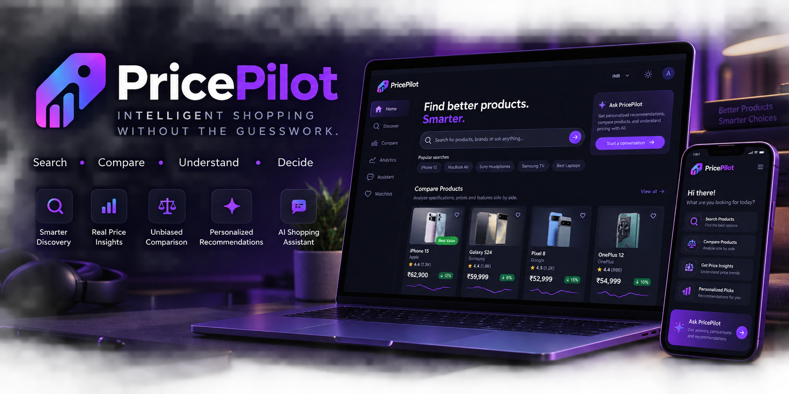
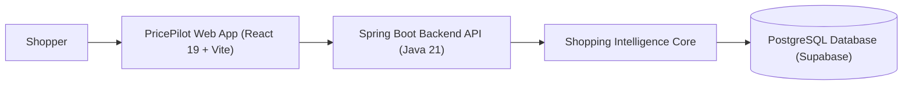

<div align="center">

# PricePilot

### Intelligent Shopping, Without the Guesswork.

<p align="center">
  <strong>Understand the price. Compare real offers. Personalize the decision. Know when to buy.</strong>
</p>

<p align="center">
  <a href="https://price-pilot-ch3q.onrender.com"></a>
  <a href="https://github.com/jadhavaayush611/Price-Pilot/releases/tag/v1.2.0"></a>
  <a href="LICENSE"></a>
</p>

<p align="center">
  
  
  
  
  
  
</p>

<p align="center">
  <a href="https://price-pilot-ch3q.onrender.com"><strong>🚀 Launch Live Web App</strong></a> &nbsp;&bull;&nbsp;
  <a href="https://pricepilot-backend-4sxk.onrender.com/actuator/health"><strong>⚡ Backend Health Check</strong></a> &nbsp;&bull;&nbsp;
  <a href="#-documentation-index"><strong>📚 Documentation Index</strong></a>
</p>

<br/>



</div>

---

<h2 align="center">The Shopping Problem</h2>

<p align="center">
Modern online shopping overwhelms consumers with scattered product listings, deceptive discounts, and opaque specifications. Price comparison platforms only answer <em>"What is the numerical price?"</em>—leaving shoppers to guess whether a deal is genuine, whether a product fits their individual needs, and whether they should buy now or wait.
</p>

---

<h2 align="center">Why PricePilot</h2>

<table width="100%">
<tr>
<td width="50%" valign="top">

### 🔍 True Pricing & Multi-Seller Intelligence
Live tracking across active merchants highlights verified lowest prices and real savings, cutting through artificial markup tricks.

</td>
<td width="50%" valign="top">

### ⚡ Natural-Language & Semantic Search
Understands conversational buyer intent (e.g. *"lightweight laptop with long battery life under ₹60,000"*) through local deterministic vector matching.

</td>
</tr>
<tr>
<td width="50%" valign="top">

### ⚖️ Side-by-Side Comparison Matrix
Compare 2 to 5 products simultaneously with structured spec matrices, feature trade-offs, and objective category winner scoring.

</td>
<td width="50%" valign="top">

### 🎯 Preference-Driven Personalization
Factors explicit user preferences (preferred brands, budget limits, decision priorities) and behavioral signals to tailor product rankings.

</td>
</tr>
<tr>
<td width="50%" valign="top">

### 📊 Price Analytics & Trajectory
Visual price fluctuation timelines across days and months with automated deal quality ratings and data-driven buy/wait guidance.

</td>
<td width="50%" valign="top">

### 🤖 Evidence-Grounded AI Assistant
Conversational shopping companion that reasons strictly over verified catalog specifications and live merchant offers without hallucination.

</td>
</tr>
</table>

---

<h2 align="center">The Shopping Journey</h2>

```
Search  →  Discover  →  Compare  →  Analyze  →  Decide
```

<table width="100%">
<tr>
<td width="20%" align="center"><strong>1. Search</strong><br/>Express needs in conversational natural language or structured keywords.</td>
<td width="20%" align="center"><strong>2. Discover</strong><br/>Surface candidates ranked by semantic relevance, deal quality, and user preferences.</td>
<td width="20%" align="center"><strong>3. Compare</strong><br/>Evaluate 2 to 5 products side-by-side with clear feature and pricing matrices.</td>
<td width="20%" align="center"><strong>4. Analyze</strong><br/>Inspect historical price shifts and merchant offers to time the purchase.</td>
<td width="20%" align="center"><strong>5. Decide</strong><br/>Choose the optimal product from the right seller at the right price with confidence.</td>
</tr>
</table>

---

<h2 align="center">Product Workflows</h2>

<table width="100%">
<tr>
<td width="50%" valign="top">

### 🔍 Intelligent Discovery
- Natural-language query interpretation with constraint extraction
- Hybrid search combining PostgreSQL full-text and semantic vectors
- Multi-faceted filtering by category, brand, price range, and rating

</td>
<td width="50%" valign="top">

### ⚖️ Multi-Product Comparison
- Side-by-side comparison for 2 to 5 candidate products
- Automated winner scoring across performance, value, and features
- Clear trade-off analysis highlighting pros, cons, and differences

</td>
</tr>
<tr>
<td width="50%" valign="top">

### 📈 Price Trajectory & Analytics
- Multi-seller offer tracking with direct merchant links
- Interactive price histories across 30 to 90-day timeframes
- Automated deal quality ratings (Great Deal, Fair, Above Average)

</td>
<td width="50%" valign="top">

### 🤖 Grounded Shopping Assistant
- Conversational discussion grounded in verified catalog data
- Contextual advice based on user shopping preferences
- Instant deterministic responses without paid third-party API dependencies

</td>
</tr>
<tr>
<td width="50%" valign="top">

### 🔔 Watchlists & Price Alerts
- Target price monitoring with custom threshold configuration
- Automated threshold validation against historical lows
- Monitored product list with real-time price status badges

</td>
<td width="50%" valign="top">

### 🌐 Multi-Currency Precision
- Internal pricing calculations use canonical USD as source of truth
- Real-time conversion and presentation in INR, USD, EUR, GBP, and JPY
- Mathematical ranking invariance across all display currencies

</td>
</tr>
</table>

---

<h2 align="center">Intelligence & Architecture</h2>

PricePilot is engineered as a clean, modular monolith with high cohesion and stateless horizontal scalability.


```mermaid
flowchart LR
    Shopper["Shopper"] --> App["PricePilot Web App (React 19 + Vite)"]
    App --> API["Spring Boot Backend API (Java 21)"]
    API --> Intel["Shopping Intelligence Core"]
    Intel --> DB[("PostgreSQL Database (Supabase)")]
```

> [!IMPORTANT]
> **Evidence-Grounded Intelligence Guarantee**: The backend is the single authoritative source of truth. Semantic search and conversational assistants consume structured relational evidence rather than replacing it. All prices, discount percentages, rankings, and eligibility determinations are calculated deterministically.

For complete architectural details, inspect the [System Architecture Specification](docs/ARCHITECTURE.md) and [Semantic Intelligence Architecture](docs/SEMANTIC_INTELLIGENCE_ARCHITECTURE.md).

---

<h2 align="center">What Makes PricePilot Different</h2>

<table width="100%">
<tr>
<td width="50%" valign="top">

**🔒 Stateless Backend**<br/>
Session state is secured via cryptographic JWTs; all backend services scale horizontally without server session coupling.

</td>
<td width="50%" valign="top">

**🧠 Local Deterministic Embeddings**<br/>
Self-contained vector generation ensures semantic search and recommendations run reliably without mandatory paid AI APIs.

</td>
</tr>
<tr>
<td width="50%" valign="top">

**⚡ High-Efficiency In-Memory Caching**<br/>
Low-footprint `ConcurrentMapCacheManager` with custom instrumentation for cache hit/miss observability without external cache overhead.

</td>
<td width="50%" valign="top">

**🗄️ Deterministic Schema Migrations**<br/>
Relational schemas and constraint validations are version-controlled and applied deterministically through Flyway (V1.0 through V1.20).

</td>
</tr>
<tr>
<td width="50%" valign="top">

**💱 Currency-Aware Pricing Engine**<br/>
Canonical USD persistence ensures sorting and ranking remain mathematically invariant regardless of user display currency.

</td>
<td width="50%" valign="top">

**🖼️ Safe Image Degradation**<br/>
Products with unverified or failed remote images render clean, accessible fallback placeholders across all viewports.

</td>
</tr>
</table>

---

<h2 align="center">Technology Stack</h2>

| Layer | Technology | Version | Purpose |
| :--- | :--- | :--- | :--- |
| **Frontend** | React | 19.2.6 | Single Page Application component architecture |
| | TypeScript | 6.0.2 | End-to-end type safety and contract enforcement |
| | Vite | 8.1.5 | High-speed build tooling and optimized bundle generation |
| | Tailwind CSS | 4.3.3 | Modern styling and responsive dark aesthetic |
| | Framer Motion | 12.42.2 | Fluid animations, transitions, and micro-interactions |
| | TanStack Query | 5.101.3 | Server state management and asynchronous caching |
| | Lucide React | 1.25.0 | Accessible, lightweight SVG iconography |
| **Backend** | Java | 21 LTS | Modern Java runtime standard (Eclipse Temurin) |
| | Spring Boot | 4.1.0 | Enterprise REST API framework and container |
| | Spring Data JPA | 4.x (Hibernate 7.4.1) | Object-relational mapping and repository abstraction |
| | Spring Security | 7.1 | Stateless JWT authentication and route authorization |
| | JJWT | 0.12.6 | Cryptographic JSON Web Token handling |
| | Flyway | 9.x | Deterministic relational schema migrations (V1.0 – V1.20) |
| | Micrometer | 1.x | Application metrics and runtime health probes |
| **Database** | PostgreSQL | 15+ | Relational persistence, full-text indexes, and vector store |
| **Deployment** | Render Static Site | – | Production hosting for optimized React frontend bundle |
| | Render Web Service | – | Production containerized Spring Boot backend |
| | Supabase | 15+ | Managed production PostgreSQL database |
| | Docker | – | Multi-stage, non-root container builds (`eclipse-temurin:21-jre`) |

---

<h2 align="center">Quick Start</h2>

### Prerequisites
* **JDK 21 LTS** ([Eclipse Temurin](https://adoptium.net/) recommended)
* **Node.js 20+** and **npm**
* **PostgreSQL 15+**

### 1. Start the Backend
```bash
cd backend
./mvnw clean install
./mvnw spring-boot:run
```
*Windows: use `.\mvnw.cmd`* &mdash; API starts on `http://localhost:8080/api/v1`.

### 2. Start the Frontend
```bash
cd frontend
npm install
npm run dev
```
Application starts on `http://localhost:5173/`.

*For detailed local environment setup and configuration, see the [Installation Guide](docs/INSTALLATION.md).*

---

<h2 align="center">Production Deployment</h2>

PricePilot v1.2.0 is deployed and live in production:

* **Frontend**: [https://price-pilot-ch3q.onrender.com](https://price-pilot-ch3q.onrender.com) (Render Static Site)
* **Backend API**: [https://pricepilot-backend-4sxk.onrender.com](https://pricepilot-backend-4sxk.onrender.com) (Render Web Service)
* **Database**: Managed PostgreSQL on Supabase (Schema V1.20)

*For deployment architecture, environment variables, and Docker setup, see the [Deployment Guide](docs/DEPLOYMENT.md).*

---

<h2 align="center">Product Roadmap</h2>

```
v1.0 — Intelligent Price Tracking
        │
v1.1 — Shopping Intelligence
        │
v1.2 — AI Shopping Companion  ◄ [Current Production Release]
        │
v1.3 — Marketplace Intelligence
        │
v1.4 — Predictive Shopping
        │
v2.0 — Autonomous Shopping Intelligence
```

* **v2.1 Global Expansion**: Real-time multi-region forex rates and localized merchant catalogs.
* **v2.2 Financial Intelligence**: Total cost of ownership calculators and installment optimization.
* **v2.3 Developer Platform**: Public REST APIs, webhook alert notifications, and partner SDKs.
* **v2.4 Retail Intelligence**: Merchant pricing dynamics and inventory trend forecasting.

---

<h2 align="center">Documentation Index</h2>

<table width="100%">
<tr>
<td width="33%" valign="top">

### 🚀 Getting Started
- [Local Installation Guide](docs/INSTALLATION.md)
- [Deployment Guide](docs/DEPLOYMENT.md)
- [Production Readiness Audit](docs/PRODUCTION_READINESS.md)

</td>
<td width="33%" valign="top">

### 🏛️ Architecture & Design
- [System Architecture Overview](docs/ARCHITECTURE.md)
- [Semantic Intelligence Architecture](docs/SEMANTIC_INTELLIGENCE_ARCHITECTURE.md)
- [Currency Subsystem](docs/CURRENCY.md)
- [Product Domain Design](docs/product_domain.md)
- [Price History Architecture](docs/price_history_architecture.md)
- [Watchlist Architecture](docs/watchlist_architecture_documentation.md)
- [User Interaction Architecture](docs/user_interaction_architecture.md)
- [Data Pipeline Architecture](docs/DATA_PIPELINE.md)
- [Observability Guide](docs/OBSERVABILITY.md)

</td>
<td width="33%" valign="top">

### 🤖 Intelligence & APIs
- [REST API Documentation](docs/API_DOCUMENTATION.md)
- [AI Assistant Architecture](docs/AI_ASSISTANT_ARCHITECTURE.md)
- [ML Recommendation Engine](docs/ML_RECOMMENDATION_ENGINE.md)
- [FastAPI AI Architecture](docs/FASTAPI_AI_ARCHITECTURE.md)
- [Architecture Decisions (ADRs)](docs/DECISIONS.md)
- [Technical Debt Register](docs/TECHNICAL_DEBT.md)

</td>
</tr>
</table>

---

<h2 align="center">Community & License</h2>

<p align="center">
  <a href="CONTRIBUTING.md"><strong>Contributing Guidelines</strong></a> &nbsp;&bull;&nbsp;
  <a href="CODE_OF_CONDUCT.md"><strong>Code of Conduct</strong></a> &nbsp;&bull;&nbsp;
  <a href="SECURITY.md"><strong>Security Policy</strong></a> &nbsp;&bull;&nbsp;
  <a href="LICENSE"><strong>MIT License</strong></a>
</p>

<p align="center">
  PricePilot is open-source software licensed under the <a href="LICENSE">MIT License</a>.
</p>