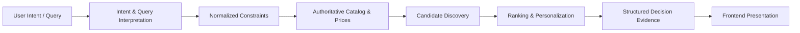

<div align="center">

# PricePilot

### Intelligent Shopping, Without the Guesswork.

<p align="center">
  <strong>Understand the price. Compare real offers. Personalize the decision. Know when to buy.</strong>
</p>

<p align="center">
  <a href="https://price-pilot-ch3q.onrender.com"></a>
  <a href="https://github.com/jadhavaayush611/Price-Pilot/releases/tag/v1.2.0"></a>
  <a href="LICENSE"></a>
  <a href="https://adoptium.net/"></a>
  <a href="https://spring.io/projects/spring-boot"></a>
  <a href="https://react.dev/"></a>
  <a href="https://www.typescriptlang.org/"></a>
  <a href="https://tailwindcss.com/"></a>
  <a href="https://www.postgresql.org/"></a>
</p>

<p align="center">
  <a href="https://price-pilot-ch3q.onrender.com"><strong>Explore Live Demo &rarr;</strong></a> &nbsp;|&nbsp;
  <a href="https://github.com/jadhavaayush611/Price-Pilot/releases/tag/v1.2.0"><strong>GitHub Release Notes</strong></a> &nbsp;|&nbsp;
  <a href="#documentation-index"><strong>Documentation Index</strong></a>
</p>

</div>

---

**PricePilot** is shopping decision intelligence designed to help buyers navigate modern e-commerce complexity. Most commerce tools simply aggregate raw product listings and surface scattered numerical prices. PricePilot bridges the gap between raw data and confident buying decisions by uniting natural-language intent parsing, deterministic semantic discovery, multi-product comparison matrices, personalized recommendation reasoning, and evidence-grounded conversational assistance into a single unified platform.

---

## The Product Story: Beyond Price Comparison

Traditional e-commerce tools answer only one basic question: *"What is the price?"*

PricePilot expands this into an end-to-end consumer decision journey:

```
What is the price?
        ↓
Which product is better?
        ↓
Which product is better for me?
        ↓
Where should I buy it?
        ↓
When should I buy it?
```

PricePilot transitions beyond basic price aggregation into full shopping decision support. Instead of isolating numbers on a screen, the system evaluates merchant trust, price volatility, historical trends, explicit buyer preferences, and behavioral signals to help shoppers make well-informed purchasing decisions with clarity and confidence.

---

## Core Capabilities

| Capability | Description |
| :--- | :--- |
| **🔍 Natural-Language Discovery** | Interprets conversational, multi-constraint buyer queries into structured catalog criteria (e.g. *"noise-cancelling headphones for travel under ₹25,000"*). |
| **⚡ Semantic + Structured Search** | Combines full-text search with local deterministic vector embeddings for precise keyword and conceptual product discovery. |
| **⚖️ 2–5 Product Comparison Matrix** | Side-by-side spec comparison, price variance across merchants, trade-off breakdowns, and objective category winner scoring. |
| **🎯 Personalized Recommendations** | Factors explicit user preferences (favorite brands, price ceilings, decision priorities) and behavioral signals to tailor product rankings. |
| **🔄 Personalized Alternatives** | Automatically surfaces comparable alternatives when products are out of stock, overpriced, or lack verified merchants. |
| **📊 Product Price Analytics** | Interactive historical price tracking across days, weeks, and months with volatility indicators and deal quality ratings. |
| **🏪 Multi-Seller Offer Comparison** | Compares active merchant prices in real time, identifying verified lowest prices and direct merchant product links. |
| **🔔 Watchlists & Price Alerts** | Sets target price thresholds on monitored products with automated sanity checks against historical lows to prevent false alerts. |
| **🤖 Evidence-Grounded Assistant** | Conversational shopping companion that reasons strictly over verified catalog facts, live prices, and user preferences. |
| **🌐 Deterministic Multi-Currency** | Internal calculations use canonical USD while seamlessly converting and displaying localized prices in INR, USD, EUR, GBP, and JPY. |
| **🖼️ Real Product Imagery** | Displays verified product photography with graceful, accessible fallback placeholders across all viewports. |

---

## How PricePilot Thinks

PricePilot is built on a strict evidence-driven architecture. The backend service serves as the authoritative source of truth, ensuring that conversational and semantic systems construct recommendations strictly on top of structured facts.


```mermaid
flowchart LR
    A["User Intent / Query"] --> B["Intent & Query Interpretation"]
    B --> C["Normalized Constraints"]
    C --> D["Authoritative Catalog & Prices"]
    D --> E["Candidate Discovery"]
    E --> F["Ranking & Personalization"]
    F --> G["Structured Decision Evidence"]
    G --> H["Frontend Presentation"]
```

> [!IMPORTANT]
> **Core Architectural Guarantee**: The backend is the single source of truth. Semantic and conversational systems consume structured evidence rather than replacing it. All prices, discount percentages, rankings, and eligibility determinations are computed deterministically.

1. **User Query**: Shopper enters a natural-language search, filter query, or assistant prompt.
2. **Intent & Interpretation**: The engine extracts category constraints, brand mentions, price boundaries, and feature priorities.
3. **Normalized Constraints**: Search bounds and numerical values are normalized into canonical USD criteria.
4. **Authoritative Retrieval**: The catalog and pricing repositories query validated PostgreSQL records.
5. **Candidate Discovery**: Semantic vector matching and structured filters surface eligible products.
6. **Ranking & Personalization**: Multi-attribute ranking scores candidates against user preferences, seller reliability, and value.
7. **Structured Evidence**: A verified evidence bundle is assembled containing specifications, price trends, and trade-offs.
8. **Frontend Presentation**: The client renders visual product cards, comparison matrices, or conversational guidance.

---

## Architecture

PricePilot is engineered as a clean, modular monolith with high cohesion and stateless horizontal scalability.

```mermaid
graph TD
    Browser["Client Browser<br/>(React 19 + TypeScript + Vite)"]
    API["Spring Boot Backend API<br/>(Java 21 LTS)"]
    DB[("PostgreSQL Database<br/>(Supabase Managed Store & Vectors)")]

    subgraph Backend_Intelligence["Spring Boot Intelligence Core"]
        Catalog["Catalog & Pricing Service"]
        Query["Query Interpreter & Normalizer"]
        Semantic["Local Deterministic Semantic Engine"]
        Personalization["Personalization & Behavioral Signals"]
        Comparison["Multi-Product Comparison (2–5 items)"]
        Analytics["Product-Driven Price Analytics"]
        Assistant["Evidence-Grounded Shopping Assistant"]
        Watchlist["Watchlists & Price Alerts"]
    end

    Browser <-->|REST API / JSON<br/>(Stateless JWT)| API
    API --> Backend_Intelligence
    Backend_Intelligence <-->|Flyway Schemas / JPA| DB
```

### Key Architectural Characteristics
- **Stateless Backend**: Session state is authenticated via cryptographic JWTs; all business services scale horizontally.
- **In-Memory Caching**: High-throughput, low-footprint `ConcurrentMapCacheManager` with custom instrumentation for cache hit/miss observability without external cache dependencies.
- **Local Deterministic Embeddings**: Self-contained vector generation ensures semantic search operates reliably without third-party hosted AI dependencies.
- **Deterministic Schema Migrations**: Relational schemas and constraint updates are version-controlled and applied deterministically through Flyway (V1.0 through V1.20).

---

## Technology Stack

| Layer | Technology | Version | Purpose |
| :--- | :--- | :--- | :--- |
| **Frontend** | React | 19.2.6 | Single Page Application component architecture |
| | TypeScript | 6.0.2 | End-to-end type safety and contract enforcement |
| | Vite | 8.1.5 | High-speed build tooling and optimized bundle generation |
| | Tailwind CSS | 4.3.3 | Responsive utility styling and modern design system |
| | Framer Motion | 12.42.2 | Fluid animations, transitions, and micro-interactions |
| | TanStack Query | 5.101.3 | Server state management and optimistic caching |
| | Lucide React | 1.25.0 | Clean, accessible SVG iconography |
| **Backend** | Java | 21 LTS | Modern Java runtime standard (Eclipse Temurin) |
| | Spring Boot | 4.1.0 | Enterprise REST API and application container |
| | Spring Data JPA | 4.x (Hibernate 7.4.1) | Object-relational mapping and repository abstraction |
| | Spring Security | 7.1 | Stateless JWT authentication and route authorization |
| | JJWT | 0.12.6 | Cryptographic JSON Web Token encoding and validation |
| | Flyway | 9.x | Deterministic relational schema migrations (V1.0 – V1.20) |
| | Micrometer | 1.x | Application metrics and runtime health probes |
| **Database** | PostgreSQL | 15+ | Relational persistence, full-text indexes, and vector store |
| **Deployment** | Render Static Site | – | Production hosting for optimized React frontend bundle |
| | Render Web Service | – | Production containerized Spring Boot backend |
| | Supabase | 15+ | Managed production PostgreSQL database |
| | Docker | – | Multi-stage, non-root container builds (`eclipse-temurin:21-jre`) |

---

## Live Production Deployment

PricePilot v1.2.0 is actively deployed and live in production:

* **Production Frontend**: [https://price-pilot-ch3q.onrender.com](https://price-pilot-ch3q.onrender.com) (Render Static Site)
* **Production Backend API**: [https://pricepilot-backend-4sxk.onrender.com](https://pricepilot-backend-4sxk.onrender.com) (Render Web Service)
* **Database**: Managed PostgreSQL hosted on Supabase (Schema V1.20)

---

## Local Development

### Prerequisites
* **Java Development Kit (JDK) 21 LTS** ([Eclipse Temurin](https://adoptium.net/) recommended)
* **Node.js 20+** and **npm**
* **PostgreSQL 15+** running locally (or reachable remotely)

---

### Backend Setup

1. Navigate to the backend directory:
   ```bash
   cd backend
   ```
2. Build the application and run all tests:
   * **Linux / macOS**:
     ```bash
     ./mvnw clean install
     ```
   * **Windows**:
     ```powershell
     .\mvnw.cmd clean install
     ```
3. Launch the Spring Boot backend server:
   * **Linux / macOS**:
     ```bash
     ./mvnw spring-boot:run
     ```
   * **Windows**:
     ```powershell
     .\mvnw.cmd spring-boot:run
     ```
   The backend API will start on `http://localhost:8080/api/v1`.

---

### Frontend Setup

1. Navigate to the frontend directory:
   ```bash
   cd frontend
   ```
2. Install dependencies:
   ```bash
   npm install
   ```
3. Launch the development server:
   ```bash
   npm run dev
   ```
   The frontend application will be accessible at `http://localhost:5173/`.

---

### API Configuration

The frontend resolves its backend target through the canonical environment variable:

```env
VITE_API_URL=http://localhost:8080
```

> [!NOTE]
> `VITE_*` variables are injected by Vite at build time. The frontend API client automatically normalizes the backend origin (e.g. `http://localhost:8080` &rarr; `http://localhost:8080/api/v1`). If `VITE_API_URL` is omitted, the frontend defaults to `http://localhost:8080/api/v1` for local development.

---

### Backend Environment Variables

| Variable | Description | Default / Example |
| :--- | :--- | :--- |
| `SPRING_PROFILES_ACTIVE` | Active Spring Boot configuration profile | `dev` (use `prod` for production) |
| `SPRING_DATASOURCE_URL` | JDBC connection URL for PostgreSQL database | `jdbc:postgresql://localhost:5432/pricepilot` |
| `SPRING_DATASOURCE_USERNAME` | Database username | `postgres` |
| `SPRING_DATASOURCE_PASSWORD` | Database password | `postgres` |
| `PRICEPILOT_JWT_SECRET` | Base64-encoded secret key for signing JWT tokens | *Must decode to ≥256 bits (32 bytes)* |
| `PRICEPILOT_CORS_ALLOWED_ORIGINS` | Comma-separated list of allowed CORS origins | `http://localhost:5173,http://localhost:3000` |
| `PRICEPILOT_AI_URL` | Optional external AI microservice URL | `http://localhost:8000` |
| `PRICEPILOT_AI_API_KEY` | Optional API key for external AI microservice | `pricepilot-secret-api-key` |

---

## Testing & Quality

PricePilot enforces automated quality standards with comprehensive unit, integration, and security verification suites:

* **Backend Test Suite**: **818 / 818** tests passing (`mvn clean verify`) covering domain services, security, JPA mappings, and controllers.
* **Frontend Test Suite**: **170 / 170** tests passing (`npx vitest run`) covering components, state, currency calculations, and API error handling.
* **Production Build**: Clean TypeScript compilation (`tsc -b`) and asset bundling via Vite.
* **Security Scans**: Automated CI workflow executing OWASP Dependency Check, npm audit, and pip-audit.

```bash
# Run backend test suite
cd backend
./mvnw clean verify

# Run frontend test suite
cd frontend
npm test -- --run

# Run frontend production build
cd frontend
npm run build
```

---

## Project Structure

```
Price-Pilot/
├── backend/                       # Spring Boot 4 REST API application (Java 21)
│   ├── src/main/java/com/pricepilot/
│   │   ├── intelligence/          # Discovery, personalization, semantic vector search, assistant
│   │   ├── currency/              # Canonical USD model & multi-currency conversion
│   │   ├── product/               # Product catalog, search specifications & management
│   │   ├── productprice/          # Multi-seller price points & offer tracking
│   │   ├── pricehistory/          # Historical price tracking & analytics
│   │   ├── watchlist/             # Target price alerts & watchlist management
│   │   ├── user/                  # User accounts and preference management
│   │   ├── config/                # In-memory cache, diagnostics & database seeder
│   │   └── security/              # Stateless JWT authentication & authorization
│   └── src/main/resources/
│       ├── db/migration/          # Flyway SQL migrations (V1.0 through V1.20)
│       └── application*.properties# Profile configurations (default, dev, prod, local)
├── frontend/                      # React 19 + TypeScript + Vite SPA
│   ├── src/
│   │   ├── components/            # UI components, comparison tables, ambient effects, fallbacks
│   │   ├── context/               # Authentication and global state
│   │   ├── currency/              # Currency conversions, formatting, and storage helpers
│   │   ├── pages/                 # Discovery, Assistant, Comparison, Analytics, Watchlists, Admin
│   │   ├── services/              # Canonical Axios API client & service façade
│   │   └── types/                 # TypeScript entity and DTO definitions
│   ├── package.json               # Frontend dependencies & build scripts
│   └── vite.config.ts             # Vite build & chunking configuration
├── docs/                          # Architecture documentation, ADRs & subsystem specifications
├── .github/workflows/             # GitHub Actions CI & security scanning workflows
├── CONTRIBUTING.md                # Contribution guidelines and workflow
├── CODE_OF_CONDUCT.md            # Community code of conduct
├── SECURITY.md                    # Security policy and disclosure process
├── LICENSE                        # MIT License
└── README.md                      # Public product documentation
```

---

## Product Roadmap

```
v1.0 — Intelligent Price Tracking
        │
v1.1 — Shopping Intelligence
        │
v1.2 — AI Shopping Companion  ◄ [Current Production Release]
        │
v1.3 — Marketplace Intelligence
        │
v1.4 — Predictive Shopping
        │
v2.0 — Autonomous Shopping Intelligence
```

### Future Horizons
* **v2.1 Global Expansion**: Real-time multi-region forex rates and localized merchant catalog integration.
* **v2.2 Financial Intelligence**: Affordability indices, total cost of ownership calculators, and installment optimization.
* **v2.3 Developer Platform**: Public REST APIs, webhook alert notifications, and partner SDK extensions.
* **v2.4 Retail Intelligence**: Merchant pricing dynamics and inventory trend forecasting.

---

## Documentation Index

Explore our comprehensive technical guides and architectural specifications:

* **Setup & Getting Started**:
  * [Local Installation Guide](docs/INSTALLATION.md)
  * [Deployment Guide](docs/DEPLOYMENT.md)
  * [Production Readiness Audit](docs/PRODUCTION_READINESS.md)
* **Architecture & Subsystems**:
  * [System Architecture Overview](docs/ARCHITECTURE.md)
  * [Semantic Intelligence Architecture](docs/SEMANTIC_INTELLIGENCE_ARCHITECTURE.md)
  * [Currency Subsystem Architecture](docs/CURRENCY.md)
  * [Product Domain Design](docs/product_domain.md)
  * [Price History Architecture](docs/price_history_architecture.md)
  * [Watchlist Architecture Documentation](docs/watchlist_architecture_documentation.md)
  * [User Interaction & Event Architecture](docs/user_interaction_architecture.md)
  * [Data Pipeline Architecture](docs/DATA_PIPELINE.md)
  * [Observability Guide](docs/OBSERVABILITY.md)
* **API & Integration**:
  * [REST API Documentation](docs/API_DOCUMENTATION.md)
  * [AI Assistant Architecture](docs/AI_ASSISTANT_ARCHITECTURE.md)
  * [ML Recommendation Engine](docs/ML_RECOMMENDATION_ENGINE.md)
  * [FastAPI AI Architecture](docs/FASTAPI_AI_ARCHITECTURE.md)
* **Architecture Decision Records (ADRs)**:
  * [Architecture Decisions](docs/DECISIONS.md)
  * [Technical Debt Register](docs/TECHNICAL_DEBT.md)

---

## Community & Contributing

Contributions to PricePilot are welcome. Please review our community standards before opening an issue or pull request:

* [Contributing Guidelines](CONTRIBUTING.md)
* [Code of Conduct](CODE_OF_CONDUCT.md)
* [Security Policy](SECURITY.md)

---

## License

PricePilot is open-source software licensed under the [MIT License](LICENSE).