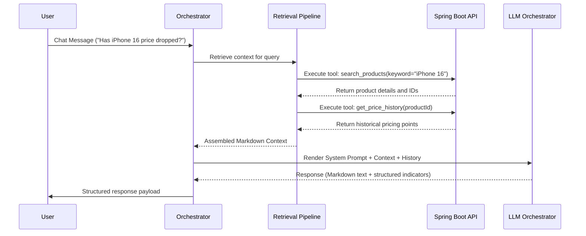

# PricePilot AI Assistant Architecture (Phase 3 Batch 5)

This document details the design, workflows, and implementation details for the conversational AI Shopping Assistant integrated into PricePilot.

ddd

---

## 1. System Architecture

The AI Assistant is built as a modular reasoning layer over the existing PricePilot microservices.

```mermaid
graph TD
    User([React User Interface])
    Boot[Spring Boot Backend]
    FastAPI[FastAPI AI Gateway]
    Orchestrator[Assistant Orchestrator]
    Router[Tool Router]
    RAG[RAG Retrieval Pipeline]
    Memory[(Conversation Memory)]
    
    User -->|POST /api/v1/assistant/chat| Boot
    Boot -->|POST /assistant/chat| FastAPI
    FastAPI --> Orchestrator
    Orchestrator --> Router
    Orchestrator --> RAG
    Orchestrator --> Memory
    
    subgraph PricePilot Backend Services
        Router -->|GET /search| Boot
        Router -->|GET /products/{id}| Boot
        Router -->|GET /recommendations| Boot
        Router -->|GET /dashboard| Boot
        Router -->|GET /analytics/products/{id}| Boot
        Router -->|GET /products/{id}/price-history| Boot
        Router -->|GET /watchlists| Boot
        Router -->|GET /users/saved-products| Boot
    end
```

---

## 2. RAG Pipeline & Context Retrieval

The assistant grounds its answers using **Retrieval-Augmented Generation (RAG)** to prevent product hallucination. 



---

## 3. Conversation Memory Management

A lightweight thread-safe in-memory session manager handles conversational context. Memory features:
- **Recent message history**: Stores the last $N$ turns to support multi-turn inquiries.
- **Active product context**: Tracks which product is currently in focus to resolve pronouns (e.g. "Is *now* a good time to buy?").
- **User preferences**: Matches user brands/categories from Spring Boot session context.
- **Redis readiness**: The interface uses standard getters/setters for simple transition to Redis.

---

## 4. Prompt Lifecycle

Prompts are stored inside `app/assistant/prompts.py` to prevent code inline string pollution.
1. **System Prompt**: Enforces the persona, context constraints, and rules.
2. **Intent Prompts**: Custom overlays for Recommendations, Price Analysis, Comparison, and Shopping Advice.
3. **Context Injection**: RAG results are formatted as structured Markdown blocks.
4. **History Injection**: Message sequence is reformatted for LLM token ingestion.

---

## 5. Security Model

- **Authentication Propagation**: JWT Bearer tokens from the frontend are passed to Spring Boot, which validates them and forwards them in the header to FastAPI. FastAPI uses this token to retrieve resource contexts securely, ensuring that users can only see their own watchlists, saved products, and profile.
- **Model Isolation**: Prompts, configuration, and API keys are entirely stored server-side. No configuration parameters are exposed to the client.
- **Input Sanitization**: User messages are validated and length-limited to prevent prompt injection.

---

## 6. Future Roadmap
1. **LangChain & LlamaIndex Integration**: Port the orchestrator to a LangChain agent.
2. **Vector DB grounding**: Integrate a vector database (e.g., pgvector) for semantic product descriptions.
3. **Voice Shopping Copilot**: Expose speech-to-text / text-to-speech layers.
4. **Autonomous Deal Monitoring**: Let agents query watchlists regularly in the background.
