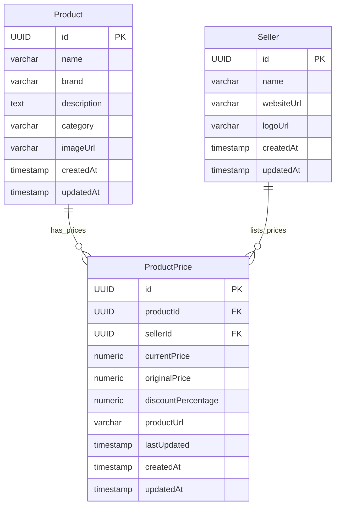

# PricePilot Architecture Overview

PricePilot follows a clean, layered architecture designed for separation of concerns, scalability, and ease of maintainability.

---

## 1. High-Level System Architecture

The project consists of three primary tiers:

```
┌────────────────────────────────────────────────────────┐
│                   Client Browser                       │
│  - Executes React UI & Framer Motion animations        │
│  - Communicates with API via Axios (using localhost)   │
└──────────────────────────┬─────────────────────────────┘
                           │
                           │ HTTP/REST (Port 80/8080)
                           ▼
┌────────────────────────────────────────────────────────┐
│             Nginx Frontend Container (Port 80)          │
│  - Serves static compiled React & HTML/CSS/JS assets   │
│  - Custom routing resolves paths to index.html         │
└──────────────────────────┬─────────────────────────────┘
                           │
                           │ Internal Network API Calls
                           ▼
┌────────────────────────────────────────────────────────┐
│          Spring Boot Backend Container (Port 8080)     │
│  - Active Profile: Prod (Java 25 runtime environment)  │
│  - Manages REST endpoints, mappings, validations       │
└──────────────────────────┬─────────────────────────────┘
                           │
                           │ PostgreSQL TCP (Port 5432)
                           ▼
┌────────────────────────────────────────────────────────┐
│            PostgreSQL DB Container (Port 5432)         │
│  - Persistent Volume: postgres_data                    │
│  - Source of truth for products, sellers, and prices  │
└────────────────────────────────────────────────────────┘
```

---

## 2. Backend Design Patterns

The backend code is organized into feature-driven packages and strictly implements the standard **Controller → Service → Repository** model:

```
User Request ──> Controller ──> Service ──> Repository ──> PostgreSQL
      DTO <── Response DTO <── Service <── JPA Entity <── Database
```

### Layer Responsibilities
1. **Controller Layer (REST Endpoints):**
   * Exposes endpoints (e.g. `ProductController`, `SellerController`).
   * Handles HTTP routing, input validation (`jakarta.validation.Valid`), and CORS headers (`@CrossOrigin(origins = "*")`).
   * **Rule:** Controllers never communicate with the database directly. They accept Request DTOs and return Response DTOs.
2. **Service Layer (Business Logic):**
   * Encapsulates core algorithms (e.g. `ProductService`, `ProductPriceService`).
   * Computes price comparisons, discount amounts, and discount percentages.
   * Handles transactional boundaries (`@Transactional`).
   * Maps database entities to DTOs.
   * **Rule:** Services orchestrate domain updates and use repositories to read/write database state.
3. **Repository Layer (Data Access):**
   * Declares interfaces (e.g. `ProductRepository`, `ProductPriceRepository`) extending `JpaRepository`.
   * Implements custom queries (JPQL or Specifications) for multi-faceted filters and sorting.
   * **Rule:** Isolated to SQL execution and Hibernate translation.

---

## 3. Database Schema & Domain Relationships

The data model connects products to multiple competing sellers via the price record:



* **One-to-Many Relationships:**
  * One `Product` has many `ProductPrice` entries.
  * One `Seller` has many `ProductPrice` entries.
* **Many-to-One Relationships:**
  * `ProductPrice` references exactly one `Product` and one `Seller`.

---

## 4. Frontend Architecture

The frontend is a lightweight Single Page Application (SPA) built on React 19, TypeScript, and Vite 8:
* **Tailwind CSS v4:** Handles all modern styling, utilizing utility classes.
* **Framer Motion:** Power-packs high-end responsive animations and micro-interactions for a premium feel.
* **Lucide Icons:** Provides standard high-quality system icons.
* **Axios API Client:** Coordinates JSON data fetch requests from the backend API.
* **Environment variables:** Resolves `import.meta.env.VITE_API_BASE_URL` to route requests to the container-exposed backend.

---

## 5. Deployment Orchestration

* **Health Orchestration:** Prevents the backend from starting before the database is ready, and prevents the frontend from starting before the backend is ready.
* **Docker Network:** All three services communicate on a private bridge network (`pricepilot-network`). Only backend and frontend ports are exposed to the host machine for safety.
* **Data Volume:** Persists PostgreSQL records across container restarts (`postgres_data`).

---

## 6. Personalized Shopping Intelligence (v1.2)

The Personalized Shopping Intelligence subsystem establishes an immutable domain layer that captures and normalizes personalization context for intelligent product ranking and recommendations.

### Core Architectural Principle
> **"Personalization changes ranking and selection among objectively valid candidates. It does not change product facts or override hard constraints."**

### Key Subsystem Components
1. **PersonalizationContext (`com.pricepilot.intelligence.personalization.context.PersonalizationContext`):**
   * Immutable, user-scoped domain object representing the complete personalization state for a single intelligence request.
   * Completely uncoupled from JPA persistence, HTTP sessions, database entities, and recommendation algorithms.
2. **Provenance & Source Distinction (`PersonalizationSource`):**
   * Preserves explicit provenance: `EXPLICIT_PREFERENCE` (user-configured shopping profile) vs `BEHAVIORAL_SIGNAL` (deterministic aggregated interactions).
   * Enforces the architectural rule: `EXPLICIT_PREFERENCE > BEHAVIORAL_SIGNAL` in confidence and ranking authority without prematurely collapsing signals into an undifferentiated number.
3. **Bounded Signal Representation (`SignalStrength` & `PersonalizationSignal`):**
   * Signal strength is strictly bounded in the range `[0.0, 1.0]`, rejecting NaN, infinite, and out-of-bounds values to prevent unbounded personalization bias.
4. **Deterministic Ordering & Construction (`PersonalizationContextBuilder`):**
   * Sorts signals by `(signalType, source, targetKey, normalizedValue, strength)` deterministically, ensuring `Context A.equals(Context B)` regardless of input collection sequencing or JVM map iteration order.
   * Deduplicates duplicate signals while retaining the highest signal strength.
5. **Hard-Constraint Boundary:**
   * Personalization context provides preference guidance only and cannot override deterministic product facts or hard shopping filters (e.g. strict budget bounds, stock availability, category boundaries, security policies).
6. **Privacy Boundary:**
   * Stores normalized domain signals only (e.g. preferred categories, normalized brand affinity). Does not store raw clickstreams, search transcripts, timestamps of individual events, or private activity logs in context.
7. **Explicit Preference Integration (`com.pricepilot.intelligence.personalization.preference.adapter.ExplicitPreferenceAdapter`):**
   * Adapts the existing v1.1 explicit preference system (`UserShoppingPreferenceService` / `UserShoppingPreferenceEntity`) into the normalized `PersonalizationContext`.
   * **Single Source of Truth:** Existing v1.1 preference storage remains authoritative; no duplicate preference tables or entities are introduced.
   * **Cache Reuse:** Directly leverages the existing Spring/Redis `@Cacheable("user-preferences")` cache layer without duplicate caching mechanisms.
   * **Explicit Provenance:** All mapped signals are tagged strictly with `PersonalizationSource.EXPLICIT_PREFERENCE` (no behavioral contamination).
   * **Missing Preference & Partial Handling:** Users without persisted preferences receive a valid empty `PersonalizationContext` with zero fabricated signals.
   * **Failure Isolation:** Persistence errors gracefully fall back to an empty context for uninterrupted base intelligence, while security and authorization exceptions are preserved.
   * **Zero AI/API-Key Dependency:** Entire pipeline operates 100% locally and deterministically.
8. **Behavioral Signal Integration (`com.pricepilot.intelligence.personalization.signals.adapter.BehavioralSignalAdapter`):**
   * Adapts the existing v1.1 behavioral extraction system (`BehavioralSignalService` / `UserShoppingSignals`) into the normalized `PersonalizationContext`.
   * **Single Source of Truth:** Existing v1.1 behavioral aggregation remains authoritative; the adapter does NOT reprocess raw events or create duplicate event repositories.
   * **Safeguard Reuse:** Directly preserves existing 3-minute deduplication windows, replay protection, and satiation caps (max 5 views/interactions per product) enforced by `BehavioralSignalServiceImpl`.
   * **Behavioral Provenance:** All mapped signals are tagged strictly with `PersonalizationSource.BEHAVIORAL_SIGNAL` with strength bounded in $[0.0, 1.0]$.
   * **Explicit/Behavioral Coexistence:** Signals targeting the same dimension (e.g., category "laptops") coexist as distinct signals (`CATEGORY_PREFERENCE` vs `CATEGORY_AFFINITY`) without overwriting each other.
   * **Privacy & User Isolation:** Context contains only aggregate affinity signals (category, brand, product interaction); no raw clickstreams, timestamps, or IP addresses are exposed.
   * **Missing History & Failure Isolation:** Users with zero interactions receive an empty context with no fabricated signals; unexpected retrieval errors degrade gracefully to an empty behavioral context.
9. **Personalized Scoring Engine (`com.pricepilot.intelligence.personalization.scoring`):**
   * Computes bounded, deterministic personalized score adjustments on product candidates based exclusively on `PersonalizationContext`.
   * **Core Mathematical Formula:**
     $$\text{PersonalizedScore} = \text{BaseScore} + \text{BoundedPersonalizationAdjustment}$$
     $$\text{Adjustment} \in [-30.0, +35.0]$$
     $$\text{FinalScore} = \text{clamp}(\text{round}(\text{BaseScore} + \text{Adjustment}, 1), 0.0, 100.0)$$
   * **Empty Context Neutrality:** When `PersonalizationContext.isEmpty()`, `Adjustment = 0.0` and `FinalScore == BaseScore`.
   * **Hard Constraints & Product Invariance:** Scoring operates as a pure ranking modifier. It cannot mutate underlying product facts, alter candidate availability, or bypass security/eligibility boundaries.
   * **Weighted Signals & Evidence:**
     * Preferred Category Match: `+12.0` (`PREFERRED_CATEGORY`)
     * Preferred Brand Match: `+10.0` (`PREFERRED_BRAND`)
     * Within Budget: `+8.0` (`WITHIN_BUDGET`) / Exceeds Budget: `-10.0` (`EXCEEDS_BUDGET`)
     * Rating Threshold Met: `+6.0` (`RATING_CRITERIA_MET`)
     * High Deal Sensitivity Match: `+8.0` (`DEAL_SENSITIVITY_MATCH`)
     * In-Stock Preference Match: `+4.0` / Out of Stock Penalty: `-20.0` (`LIMITED_AVAILABILITY`)
     * Behavioral Category Affinity: `affinity * 6.0` (`BEHAVIORAL_AFFINITY`)
     * Behavioral Brand Affinity: `affinity * 4.0` (`BEHAVIORAL_AFFINITY`)
     * Behavioral Interaction Affinity: `+3.0` (`BEHAVIORAL_AFFINITY`)
   * **Deterministic 5-Tier Tie-Breaking:** Candidate ranking strictly breaks ties across: (1) final score desc, (2) base score desc, (3) personalization adjustment desc, (4) lowest price asc, and (5) lexicographical product UUID asc.
10. **Personalized Evidence (`com.pricepilot.intelligence.personalization.evidence`):**
    * Generates deterministic, grounded explainability evidence explaining the `PersonalizedScore` generated by Phase 6.4.
    * **Core Invariant:** Evidence explains the score; evidence never creates, modifies, or recalculates the score.
    * **Grounding & Provenance:**
      * Inspects the structured scoring breakdown in `PersonalizedScore` and verifies supporting facts against `ProductResponseDTO` and `PersonalizationContext`.
      * Explicit preferences produce factual match statements (`PREFERRED_CATEGORY`, `PREFERRED_BRAND`, `WITHIN_BUDGET`, `RATING_CRITERIA_MET`, `DEAL_SENSITIVITY_MATCH`).
      * Behavioral signals produce non-prescriptive affinity statements (`BEHAVIORAL_AFFINITY` for recent activity and brand interest) without claiming explicit user configuration.
    * **Privacy Boundary:** Evidence descriptions strictly omit raw clickstreams, timestamps, IP addresses, or internal event identifiers.
    * **Deterministic Ordering:** Evidence items are ordered deterministically by importance descending, then EvidenceType name, then description.
    * **Immutability & Safety:** All evidence collections are exposed via unmodifiable lists in `PersonalizedEvidence`. Zero persistence, Redis, or external AI dependencies.
11. **Personalized Discovery (`com.pricepilot.intelligence.discovery.personalized`):**
    * Integrates the completed personalization engine (`PersonalizationContextProvider`, `PersonalizedScoringStrategy`, `PersonalizedEvidenceGenerator`) into the discovery pipeline.
    * **Discovery Request Pipeline:**
      $$\text{Discovery Request} \rightarrow \text{Hard-Filter Retrieval} \rightarrow \text{Base Scoring} \rightarrow \text{Context Acquisition} \rightarrow \text{Personalized Scoring} \rightarrow \text{Ranking} \rightarrow \text{Paging} \rightarrow \text{Evidence Generation} \rightarrow \text{Response}$$
    * **Hard Constraint Invariance:** Personalization strictly modifies ranking among eligible candidates; hard filters (budget max, category, brand, stock) and pagination limits are enforced prior to personalization.
    * **Authentication Boundary & Security:**
      * Public unauthenticated discovery requests (`personalized=false`) remain completely public and execute without touching user context.
      * Personalized discovery (`personalized=true` or `/api/v1/discovery/personalized`) requires an authenticated user principal (`UserPrincipal`). Unauthenticated requests are rejected (401/403). Arbitrary `userId` query parameters are ignored.
    * **Single-Pass Context Acquisition:** Context is acquired exactly once per discovery request via `PersonalizationContextProvider` and applied consistently across all candidates.
    * **Optimized Page-Level Evidence Generation:** To minimize latency, personalized evidence generation is performed strictly on the requested page slice of ranked candidates rather than all candidates.
    * **Graceful Degradation:** If context acquisition encounters errors or the user has no history/preferences, the system seamlessly falls back to base relevance ranking with zero score adjustments.
    * **Observability:** Key metrics tracked via Micrometer `MeterRegistry` (`discovery.personalized.requests`, `discovery.personalized.latency`, `discovery.personalized.candidates`, `discovery.personalized.adjustments`).
12. **Personalized Alternative Finder (`com.pricepilot.intelligence.alternative.personalized`):**
    * Personalizes alternative discovery across product-driven, query-driven, and natural-language entry points based on the user's `PersonalizationContext`.
    * **Core Invariant:** Personalization may change the ranking among valid alternatives, but it must never make an invalid alternative valid or bypass alternative qualification rules.
    * **Alternative Pipeline Flow:**
      $$\text{Alternative Request} \rightarrow \text{Semantic + Structured Retrieval} \rightarrow \text{Hard Constraints} \rightarrow \text{Authoritative Qualification} \rightarrow \text{Base Alternative Scoring} \rightarrow \text{Personalization Context} \rightarrow \text{Personalized Scoring} \rightarrow \text{Deterministic Sort} \rightarrow \text{Slice Top-K} \rightarrow \text{Analytics Enrichment} \rightarrow \text{Personalized Evidence Generation} \rightarrow \text{Response}$$
    * **Qualification Invariance:**
      * Existing `AlternativeType` qualification semantics (`SIMILAR`, `CHEAPER`, `BETTER_VALUE`, `PERFORMANCE_UPGRADE`, `PREMIUM`, `BUDGET_FALLBACK`) remain authoritative. Candidates that fail eligibility checks are immediately discarded.
      * Source-product self-exclusion is strictly preserved.
    * **Scoring & Evidence Architecture:**
      * Reuses Phase 6.4 `PersonalizedScoringStrategy` to calculate bounded adjustments $[-30.0, +35.0]$ onto base alternative scores $[0.0, 100.0]$.
      * Reuses Phase 6.5 `PersonalizedEvidenceGenerator` to produce grounded, privacy-safe explainability metadata alongside existing objective alternative evidence (`PRICE`, `SIMILARITY`, `RATING`, `DISCOUNT`, `VALUE`).
    * **Deterministic Multi-Tier Ordering:**
      1. Personalized final score descending
      2. Generic alternative base score descending
      3. Personalization adjustment descending
      4. Semantic similarity descending
      5. Deal quality rank descending
      6. Rating descending
      7. Current price ascending
      8. Product UUID lexicographical ascending
      * When `PersonalizationContext.empty()`, adjustment is `0.0` and ordering is identical to generic alternative ordering.
    * **Security & Authentication Boundary:**
      * Generic alternatives remain public (`personalized=false`).
      * Personalized alternatives (`personalized=true` or `/personalized` endpoints) require authenticated `UserPrincipal`. Unauthenticated requests throw `AccessDeniedException` (401/403). Arbitrary `userId` parameters in requests are strictly ignored.
    * **Bounded Execution & Analytics:**
      * Candidate retrieval bounded to 50 items; final alternative results bounded to top-20.
      * Analytics and personalized evidence generation are performed on the sliced top-K results, avoiding N+1 overhead.
    * **Observability:** Tracks `pricepilot.alternative.personalized.requests`, `pricepilot.alternative.personalized.failures`, `pricepilot.alternative.personalized.fallbacks`, `pricepilot.alternative.personalized.latency`, `pricepilot.alternative.personalized.candidates`, and `pricepilot.alternative.personalized.results`.
13. **Personalized Recommendations (`com.pricepilot.intelligence.recommendation`):**
    * Orchestrates explainable, personalized product recommendations by combining candidate retrieval, multi-criteria comparison scoring, single-context personalization, and grounded explainability.
    * **Core Invariant:** "Personalization may rank objectively valid recommendation candidates differently, but it must never make an invalid candidate valid."
    * **Recommendation Pipeline Flow:**
      $$\text{Recommendation Request} \rightarrow \text{Candidate Retrieval} \rightarrow \text{Hard Constraints} \rightarrow \text{Base Comparison Scoring} \rightarrow \text{Single Context Acquisition} \rightarrow \text{Personalized Scoring} \rightarrow \text{Deterministic Ranking} \rightarrow \text{Evidence Extraction} \rightarrow \text{Grounded Personalized Evidence} \rightarrow \text{Explanation Generation} \rightarrow \text{Response}$$
    * **Scoring & Evidence Integration:**
      * Base recommendation candidates are scored using deterministic `ComparisonScoringStrategy`.
      * Personalization uses `PersonalizationContextProvider` to resolve `PersonalizationContext` once and applies `PersonalizedScoringStrategy` (Phase 6.4) with bounded adjustments $[-30.0, +35.0]$ and clamping $[0.0, 100.0]$.
      * Grounded personalized evidence generated via `PersonalizedEvidenceGenerator` (Phase 6.5) is attached to `RecommendationResponse.personalizationEvidence` and merged into explanation decision drivers.
    * **Deterministic Multi-Tier Tie-Breaking:**
      1. Personalized final score descending
      2. Base score descending
      3. Personalization adjustment descending
      4. Lowest price ascending
      5. Product UUID lexicographical ascending
      * Cold start / empty context (`PersonalizationContext.empty(userId)`) produces $0.0$ adjustment and identical ranking to generic recommendations.
    * **Authentication & Security:**
      * Public recommendation endpoints (`/api/v1/recommendations/{productId}`, `/api/v1/recommendations/compare`) remain public.
      * Personalized recommendations (`/api/v1/recommendations/personalized`) require authenticated `UserPrincipal`. Unauthenticated requests throw `AccessDeniedException` (401/403).
    * **Observability & History Logging:**
      * Records execution duration and request counters (`pricepilot.recommendation.duration`, `pricepilot.recommendation.requests.total`, `pricepilot.recommendation.confidence.distribution`).
      * Logs recommendation event history asynchronously and safely without breaking user responses.