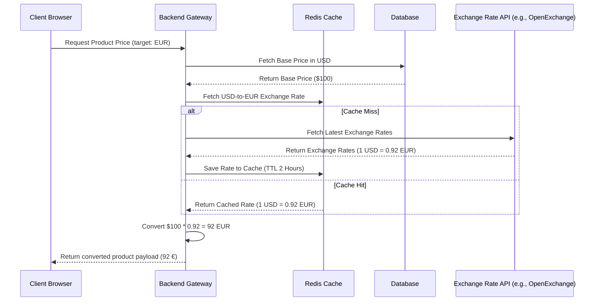

# Currency Subsystem Architecture

This document describes the architectural design, rationale, and future path of the currency subsystem in **PricePilot**.

---

## 1. Why the Database Stores USD

The database standardizes all pricing data by storing values in a single base currency: **USD** (United States Dollar).

### Benefits:
* **Simplified Queries**: Aggregation queries (e.g., finding the minimum price of a product globally, calculating average prices, or detecting price drops across multiple merchants) do not need to perform complex on-the-fly currency conversions.
* **Consistency & Determinism**: Standardizing on a single base currency avoids rounding errors and discrepancies when comparing products from different regions.
* **Performance**: Indexing and sorting on a single numeric field is highly performant. If prices were stored in various currencies, sorting by price would require expensive runtime joins or calculations.

---

## 2. Why Conversion Occurs at the API Boundary / Presentation Layer

While the database persists prices in USD, users need to view prices in their preferred local currency. The system performs currency conversion at the boundary (frontend client/API presentation layer) for the following reasons:

* **Separation of Concerns**: The persistence layer remains simple and oblivious to the user's localized display settings.
* **Real-time Personalization**: Users can toggle between currencies (USD, INR, EUR, GBP, JPY) instantly in the UI. Converting at the presentation layer enables this without requiring any backend state updates or roundtrips.
* **Caching Efficiency**: Storing and caching raw data in USD allows global cache keys (e.g., for products) to be shared across all users. If conversion happened at the database or deep API layer, separate cache entries would be needed for every currency, reducing cache hit rates.

---

## 3. Current Static Conversion Strategy

Currently, the subsystem uses a static conversion rate strategy managed entirely within the `currency` module. 

### Configuration Details:
* **Base Currency**: `USD`
* **Static Exchange Rates**:
  * **USD**: `1`
  * **INR**: `80`
  * **EUR**: `0.9`
  * **GBP**: `0.8`
  * **JPY**: `150`

### Legacy Normalization Heuristic
To handle historical pricing data that may have been stored in local currency directly (INR) before the database was standardized to USD, the system uses a heuristic:
* If a price value in the database is **greater than or equal to 5000**, it is assumed to be in **INR** and is first divided by `80` to retrieve its `USD` base value before converting it to the user's target currency.
* Otherwise, it is treated as a clean **USD** value.

---

## 4. Future Exchange-Rate Service Architecture

To support floating, real-time exchange rates, the static conversion model will evolve into a dynamic exchange-rate service.

### Key Elements of Future Architecture:
1. **Dynamic Exchange-Rate Service**: A background job on the backend that fetches exchange rates daily or hourly from a public authority (e.g., Open Exchange Rates, European Central Bank) and writes them to a database.
2. **Caching Layer**: A fast in-memory cache (Redis) stores current rates with a Time-To-Live (TTL) of 2-6 hours to avoid hitting the external API on every user request.
3. **Flexible Presentation Conversion**: The API gateway dynamically converts pricing payloads to the client's requested currency header, keeping client-side logic clean and uniform.
