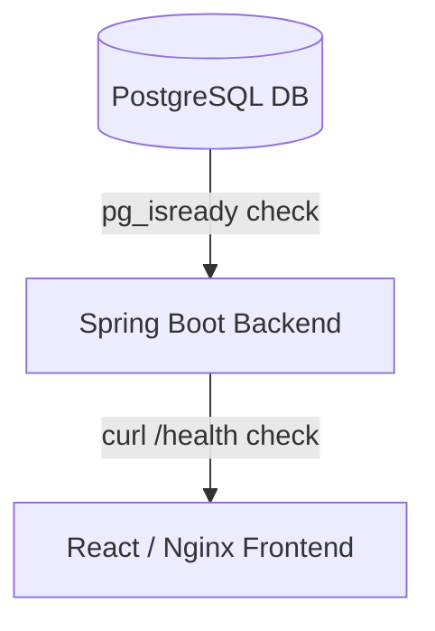

# PricePilot Deployment Guide

This guide details how to build and run the PricePilot platform in containerized environments using Docker and Docker Compose.

---

## 1. Quick Start (Local Docker Compose)

The easiest way to start the entire system (Database, Backend, and Frontend) is using Docker Compose.

### Prerequisites
* [Docker Desktop](https://www.docker.com/products/docker-desktop/) (includes Docker Compose) installed and running.

### Launching the Application
1. Navigate to the project root directory.
2. Build and start all services in the background:
   ```bash
   docker compose up --build -d
   ```
3. Docker Compose will automatically build the images, create isolated networks, orchestrate the startup order using health checks, and launch the following services:
   * **PostgreSQL Database** on port `5432` (mapped to host).
   * **Spring Boot REST API Backend** on port `8080` (mapped to host).
   * **React Vite + Nginx Frontend** on port `80` (mapped to host).

4. Open your browser and navigate to:
   * **Frontend Application:** `http://localhost/`
   * **Backend Health Check:** `http://localhost:8080/api/v1/health`

### Shutting Down
To stop and remove all containers, networks, and volumes:
```bash
docker compose down -v
```

---

## 2. Environment Variables (`.env`)

A `.env` file is located at the project root to manage the container configurations. You can customize the ports and credentials before running `docker compose up`:

| Variable | Description | Default Value |
| :--- | :--- | :--- |
| `DB_NAME` | The PostgreSQL database name | `pricepilot` |
| `DB_USER` | The database superuser name | `postgres` |
| `DB_PASSWORD` | The database user password | `postgres` |
| `DB_PORT` | Port exposed by PostgreSQL on host | `5432` |
| `BACKEND_PORT` | Port exposed by Spring Boot API on host | `8080` |
| `SPRING_PROFILES_ACTIVE` | The active Spring Boot profile | `prod` |
| `FRONTEND_PORT` | Port exposed by Nginx on host | `80` |
| `VITE_API_BASE_URL` | API URL used by the React client browser | `http://localhost:8080/api/v1` |

---

## 3. Deployment Architecture & Orchestration

The orchestration defines dependencies and health checks to prevent race conditions during startup:



* **Database Readiness:** The PostgreSQL container has a `pg_isready` health check.
* **Backend Dependency:** The Spring Boot backend waits for the database container to be healthy before starting up. It boots in the `prod` profile, running on Java 25.
* **Frontend Dependency:** The React Nginx container waits for the Spring Boot backend to be healthy before serving assets.

---

## 4. Multi-Stage Dockerfile Internals

### Backend Dockerfile (`backend/Dockerfile`)
Uses a two-stage build to reduce runtime image size and protect source code:
1. **Build Stage (`eclipse-temurin:25-jdk`):** Copies the Maven Wrapper, downloads dependencies, and compiles the source code to a jar file. Line endings of the wrapper are sanitized dynamically to support Unix runtime execution regardless of host OS.
2. **Runtime Stage (`eclipse-temurin:25-jre`):** Copies *only* the compiled JAR. Installs `curl` to run the health checks. Runs the Spring Boot process as a non-privileged context where possible.

### Frontend Dockerfile (`frontend/Dockerfile`)
Uses a two-stage build to serve static assets via Nginx:
1. **Build Stage (`node:20-alpine`):** Performs clean npm install and runs Vite build. It takes `VITE_API_BASE_URL` as a build argument to embed the correct backend endpoint.
2. **Production Web Server (`nginx:alpine`):** Copies compiled HTML/JS/CSS assets to Nginx’s default root. Deploys a custom `nginx.conf` that redirects non-file paths to `index.html` to support React Router single-page navigation.

---

## 5. Troubleshooting & Maintenance

### Checking Container Health
To inspect container status and health states:
```bash
docker compose ps
```

### Reading Logs
* View logs for all containers:
  ```bash
  docker compose logs -f
  ```
* View logs for a single service (e.g. backend):
  ```bash
  docker compose logs -f backend
  ```

### Rebuilding After Changes
If you modify backend Java classes or frontend React files, run:
```bash
docker compose up --build -d
```
This forces Docker to invalidate caches and rebuild the changed stages.
