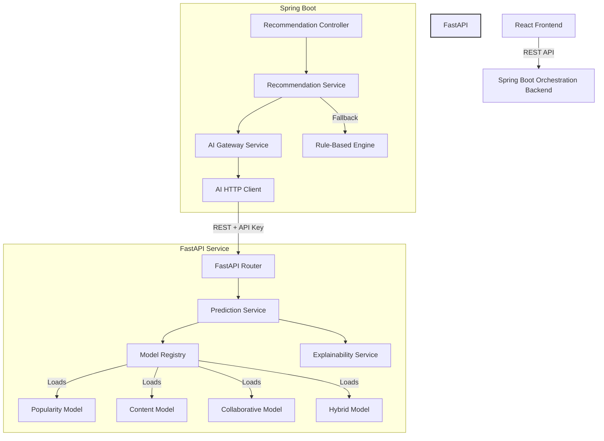
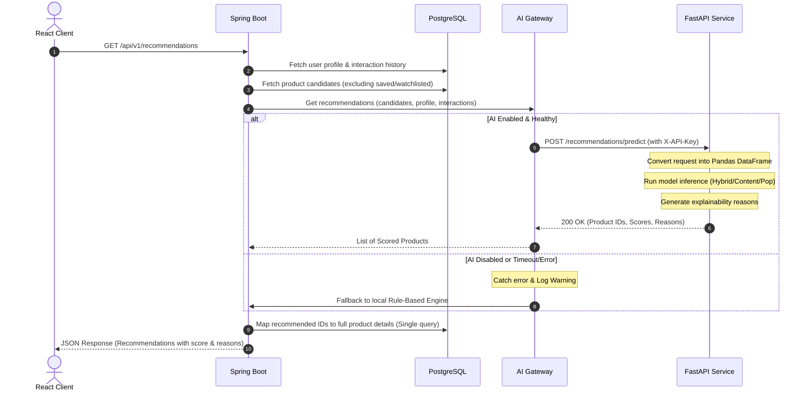

# PricePilot — Phase 3 Batch 4
# Distributed AI Microservice Architecture

This document describes the architectural transition of the PricePilot recommendation platform from a monolithic design to a distributed AI-enabled microservice architecture.

---

## 1. Architectural Overview

The target design decouples business logic from machine learning inference. 
* **Spring Boot (Port 8080)** remains the authoritative business backend and orchestration layer (managing authentication, database transactions, watchlists, etc.).
* **FastAPI (Port 8000)** becomes the dedicated stateless AI inference service serving Python-trained recommendation models.

---

## 2. Request & Prediction Pipeline Flow

When a user requests recommendations, the Spring Boot orchestrator selects candidate items and forwards them along with the user preference profile and recent interactions to FastAPI:

---

## 3. Model Lifecycle & Registry

FastAPI implements a dedicated **Model Registry** pattern:
* **Lazy Loading / Startup Loading**: All serialized model picklings (`.pkl` files) are loaded into memory once during FastAPI startup.
* **Stateless Inference**: Models are never re-fitted or reloaded on a per-request basis. Candidate list scoring is executed entirely in-memory using vector operations.
* **Hot Reloading**: The model registry supports atomic hot-reloading. Triggering `/models/reload` loads new models into a temporary workspace and swaps references atomically, preventing inference downtime.

---

## 4. Resilience & Fallback Protocol

Graceful degradation is a core engineering principle in PricePilot. If FastAPI is down or experiencing high latency:

1. **Timeout**: Connection and read timeouts are set on the Spring Boot HTTP client (default: `5000ms`).
2. **Retry Policy**: Transient failures are retried up to `3` times with configured backoffs.
3. **Gateway Circuit Fallback**: If all retries fail or if the service is marked offline:
   * A warning is logged to the orchestrator console.
   * The request automatically falls back to the Java-implemented **Rule-Based Recommendation Engine**.
   * The user receives a valid response (labeled with `Rule-Based` algorithm metadata).
   * **No 500 errors are propagated to the frontend.**

---

## 5. Security & Authentication

Internal FastAPI endpoints are protected and must not be exposed to the public internet:
1. **API Key Security**: The gateway includes the `X-API-Key` header on every call. FastAPI validates this header against `PRICEPILOT_AI_API_KEY`.
2. **Protected Management Endpoints**: Endpoints like `/models/reload` are accessible only internally to system administrators or CI/CD pipelines.

---

## 6. Observability

Observability is handled via multiple layers:
* **Request IDs**: Every HTTP call generates a unique `X-Request-ID` header, propagated through logs to trace requests from Spring Boot to FastAPI.
* **Latency Histograms**: The `/metrics` endpoint exposes Prometheus-compatible metrics tracking request counts and prediction latencies.
* **Structured Logging**: Logs are emitted as structured JSON objects containing timestamps, execution time, model version, and status flags.
