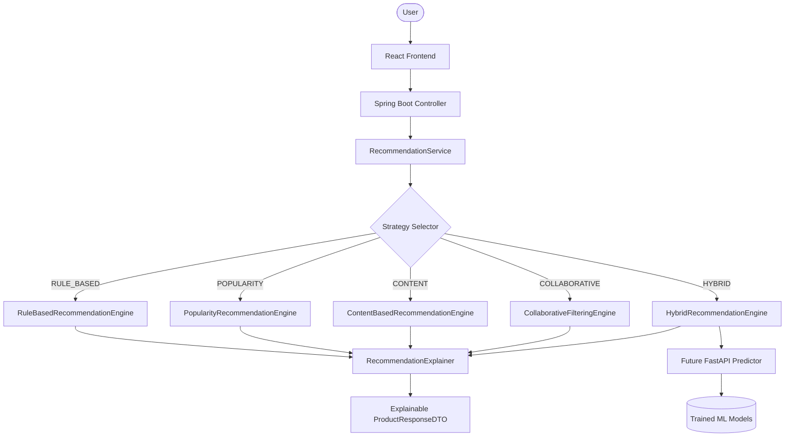

# Machine Learning Recommendation Engine

This document outlines the architecture, strategies, pipelines, and future directions for the Machine Learning Recommendation Engine introduced in **Phase 3 Batch 3** of PricePilot.

---

## 1. Overall Architecture

The recommendation subsystem is designed around the **Strategy Pattern**, allowing multiple recommendation algorithms to coexist, switch dynamically via configuration, and be evaluated offline before becoming production defaults.



### Key Architectural Guidelines
- **Configuration-Driven**: Switching the active algorithm requires only updating `pricepilot.recommendation.strategy` in properties.
- **Loose Coupling**: Engines implement a common Java interface and operate independently.
- **Explainability First**: Every recommended product must carry dynamic reasons detailing *why* it was selected.

---

## 2. Recommendation Strategies

PricePilot co-locates five distinct strategies:

| Strategy | Description | Key Signals Used | Java Implementation | Python Model |
| :--- | :--- | :--- | :--- | :--- |
| **Rule-Based** | Production fallback & benchmark | Category, Brand, Price overlap | `RuleBasedRecommendationEngine` | N/A (Rules) |
| **Popularity** | Baseline global recommender | View count, saves, watchlist, trending | `PopularityRecommendationEngine` | `PopularityRecommender` |
| **Content-Based** | Individual feature-matching | Category/brand preference, discount | `ContentBasedRecommendationEngine` | `ContentBasedRecommender` |
| **Collaborative** | Neighborhood interaction | User co-saves and watchlists | `CollaborativeFilteringEngine` | `CollaborativeFilteringRecommender` |
| **Hybrid** | Weighted combination pipeline | All the above (Normalized) | `HybridRecommendationEngine` | `HybridRecommender` |

### Hybrid Score Formula
The hybrid engine normalizes scores from Popularity, Content, and Collaborative models onto a `[0, 1]` scale and aggregates them using configurable weights:

$$\text{Score}_{\text{hybrid}} = w_{\text{pop}} \cdot S_{\text{pop}} + w_{\text{content}} \cdot S_{\text{content}} + w_{\text{collab}} \cdot S_{\text{collab}}$$

Default weights:
- `Popularity`: 0.20
- `Content`: 0.35
- `Collaborative`: 0.45

---

## 3. Feature Flow & Reusable Pipelines

To prevent training-inference skew, recommendation models consume standardized features generated by the reusable pipeline created in Batch 2. Feature engineering never occurs directly inside recommendation algorithms.

```
Raw DB Exports (CSV)
      ↓
Preprocessing & Cleaning (MissingValueHandler, DuplicateRemoval)
      ↓
Feature Engineering (ProductFeatureBuilder, UserFeatureBuilder, InteractionFeatureBuilder)
      ↓
Standardized Feature Sets (user_features.csv, product_features.csv)
      ↓
Recommendation Models (Popularity, Content-based, Collaborative)
      ↓
Explainable Inference Output
```

---

## 4. Training Pipeline

Model training is executed via Python modules rather than Jupyter notebooks. The training orchestrator (`train.py`) is run as:

```bash
python pricepilot_ml/train.py --dataset-version 1.0.0 --k 10
```

### Steps Executed
1. **Load Dataset**: Ingests raw CSV exports under `datasets/raw/`.
2. **Cleaning**: Applies duplicate removal and missing value imputation.
3. **Feature Engineering**: Runs builders from `pricepilot_ml/feature_engineering/`.
4. **Train-Test Split**: Performs a chronological split (80/20) on user interaction logs.
5. **Model Fitting**: Trains popularity, content-based, and collaborative filters.
6. **Offline Evaluation**: Evaluates all models against the test split.
7. **Model Persistence**: Serializes trained models to pickle binaries.
8. **Report Generation**: Saves training metrics to `training_report.json`.

---

## 5. Offline Evaluation Framework

We measure recommender quality using standard ranking and diversity metrics:

- **Precision@K**: Percentage of recommended items that the user actually interacted with in the test set.
- **Recall@K**: Percentage of test set items that were successfully recommended to the user.
- **MAP (Mean Average Precision)**: Measures order quality of relevant recommendations.
- **NDCG (Normalized Discounted Cumulative Gain)**: Focuses on ranking quality, placing higher utility on top-ranked items.
- **Coverage**: The percentage of the product catalog recommended to at least one user (reducing popularity bias).
- **Diversity**: The categorical intra-list distance, measuring list variety.
- **Novelty**: Average information content of recommended items, measuring target surprise.
- **Popularity Bias**: Average popularity of recommended items.

Evaluation reports are saved to `models/recommendation/training_report.json` for model version tracking.

---

## 6. Explainable Recommendations

Opacities are avoided in PricePilot. Every recommendation requires a human-readable explanation generated independently from the ranking phase.

### Example JSON Payload (ProductResponseDTO)
```json
{
  "id": "c3a8b410-d021-4f32-8822-0a1b2c3d4e5f",
  "name": "Sony WH-1000XM4 Wireless Headphones",
  "brand": "Sony",
  "category": "Electronics",
  "recommendationScore": 0.9325,
  "recommendationAlgorithm": "Hybrid",
  "recommendationReasons": [
    "Matches your preferred category: Electronics",
    "Within your preferred price range",
    "Offers a significant discount of 20%",
    "Recommended based on users with similar interests"
  ]
}
```

---

## 7. Model Lifecycle & Persistence

Persisted models are saved under `models/recommendation/` and contain:
- **`[algo]_model.pkl`**: Serialized model object containing fit weights and parameters.
- **`[algo]_metadata.json`**: JSON description of the training run, containing:
  - Algorithm name
  - Dataset version
  - Feature pipeline version
  - Training timestamp (`trainedAt`)
  - Configuration parameters
  - Offline evaluation metrics (Precision@K, NDCG@K, coverage, diversity, etc.)

---

## 8. Future FastAPI Integration (Batch 4)

In Phase 3 Batch 4, the recommendation subsystem will transition to online model serving. The groundwork is established:
1. **Dual Implementation**: Java strategies mirror the Python recommender algorithms, ensuring consistency.
2. **FastAPI Client**: The Python SDK is fully extended with an `ml` namespace (`client.ml.train()`, `client.ml.predict()`, etc.).
3. **Downstream Gateway**: The Spring Boot `MlController` acts as a gateway proxying requests to python subprocesses, which will naturally transition to REST calls to the FastAPI microservice.
