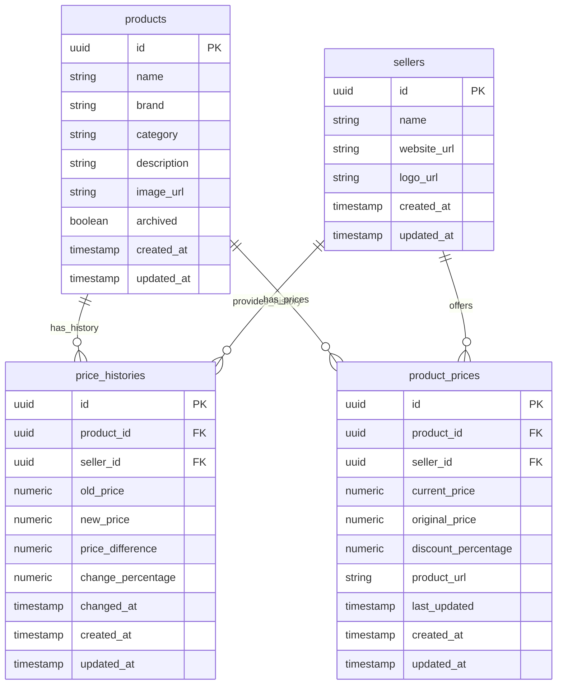
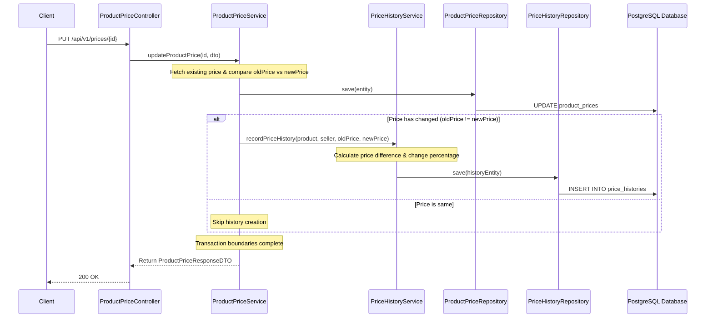

# Price History Tracking System Architecture

This document provides a comprehensive overview of the design, implementation, and future analytic paths for the **Price History Tracking** feature in the PricePilot platform.

---

## 1. ER Diagram Updates

The `price_histories` table stores immutable historical records of product price changes. It connects product and seller entities with a many-to-one mapping.

### Database Relation Schema (Mermaid)



### DDL Schema (SQL representation)

```sql
CREATE TABLE price_histories (
    id UUID NOT NULL PRIMARY KEY,
    product_id UUID NOT NULL,
    seller_id UUID NOT NULL,
    old_price DECIMAL(10, 2) NOT NULL,
    new_price DECIMAL(10, 2) NOT NULL,
    price_difference DECIMAL(10, 2) NOT NULL,
    change_percentage DECIMAL(5, 2) NOT NULL,
    changed_at TIMESTAMP NOT NULL,
    created_at TIMESTAMP NOT NULL,
    updated_at TIMESTAMP NOT NULL,
    
    CONSTRAINT fk_price_histories_product FOREIGN KEY (product_id) REFERENCES products(id) ON DELETE CASCADE,
    CONSTRAINT fk_price_histories_seller FOREIGN KEY (seller_id) REFERENCES sellers(id) ON DELETE CASCADE
);

CREATE INDEX idx_price_histories_product_id ON price_histories(product_id);
CREATE INDEX idx_price_histories_seller_id ON price_histories(seller_id);
CREATE INDEX idx_price_histories_changed_at ON price_histories(changed_at DESC);
```

> [!NOTE]
> - Indexing `changed_at DESC` guarantees sub-millisecond retrieval speeds during sorted pagination.
> - Eager join fetching (`JOIN FETCH`) is utilized in repositories to prevent N+1 queries.

---

## 2. Price Change Lifecycle & Flow

Price history tracking is managed at the Service layer, avoiding database triggers or entity listener side effects. This ensures transactions remain clean, transparent, and easy to debug.

### Tracking Lifecycle Diagram (Mermaid)



---

## 3. Backend Architecture Implementation

The implementation separates responsibilities using standard controller, service, repository, and DTO layouts.

### API Endpoints

1. **GET `/api/v1/price-history`**: Fetches all price histories globally with pagination.
2. **GET `/api/v1/products/{productId}/price-history`**: Fetches price histories for a specific product.
3. **GET `/api/v1/sellers/{sellerId}/price-history`**: Fetches price histories for a specific seller.

---

## 4. Future Analytics Dashboard Hookup

To support analytics dashboards, recommendation engines, and trend forecasting, `PriceHistoryService` includes the following highly optimized methods:

1. `getLargestPriceDrops(int limit)`: Retrieves the top `N` products with the most substantial price drops (`changePercentage < 0`, sorted ascending).
2. `getLargestPriceIncreases(int limit)`: Retrieves the top `N` products with the largest price increases (`changePercentage > 0`, sorted descending).
3. `getRecentPriceChanges(int limit)`: Retrieves the `N` most recent price changes across the catalog.

These methods utilize optimized native database queries with `JOIN FETCH` to prevent performance overhead.
