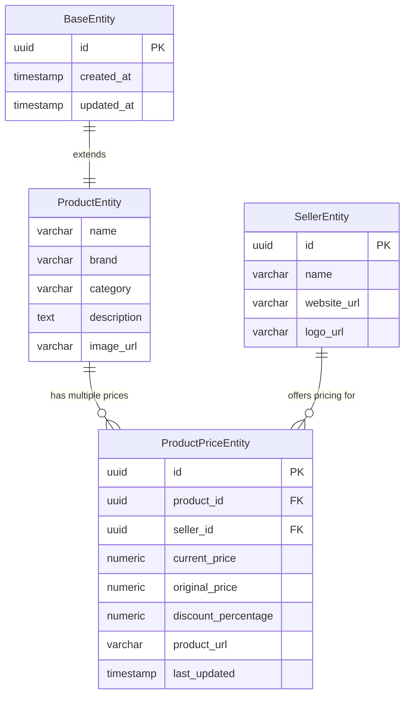

# Product Domain Documentation

This document outlines the design, schema, APIs, and frontend integration for the **Product Domain** in PricePilot.

---

## 1. Entity Relationship Explanation

The Product Domain lies at the core of the PricePilot search engine. Its entity model represents a searchable, catalogued item that can be tracked across multiple sellers.

### UML Entity Relationship



### Relationship Mechanics
1. **Inheritance**: `ProductEntity` extends `BaseEntity`, inheriting the globally unique identifier (`UUID`) and audit timestamps (`createdAt`, `updatedAt`).
2. **One-to-Many Link**: One `ProductEntity` is referenced by multiple price points (`ProductPriceEntity`). In subsequent implementation phases, deleting a product will cascade deletions to its associated prices.
3. **Many-to-One Reference**: Each price entry references exactly one product and one seller, forming the bridge that enables the core price comparison feature.

---

## 2. Database Schema Documentation

The database table `products` is designed for high-performance retrieval and search index optimization.

### SQL Table Schema (PostgreSQL)

```sql
CREATE TABLE products (
    id UUID NOT NULL,
    created_at TIMESTAMP WITHOUT TIME ZONE NOT NULL,
    updated_at TIMESTAMP WITHOUT TIME ZONE NOT NULL,
    name VARCHAR(255) NOT NULL,
    category VARCHAR(255) NOT NULL,
    brand VARCHAR(255),
    description TEXT,
    image_url VARCHAR(255),
    
    CONSTRAINT pk_products PRIMARY KEY (id)
);

-- Index for optimized product catalog search
CREATE INDEX idx_products_search ON products (name, brand, category);
```

### Column Specifications
* **`id`**: Generates a version-4 UUID automatically using Hibernate/JPA auditing logic. Non-updatable.
* **`created_at` / `updated_at`**: Audited timestamp columns. Handled automatically by Spring Data JPA's `@EnableJpaAuditing` and `@EntityListeners(AuditingEntityListener.class)`.
* **`name`**: The user-facing product title. Mandatory column (`NOT NULL`).
* **`category`**: The category categorization of the product (e.g. `Electronics`). Mandatory column (`NOT NULL`).
* **`brand`**: Brand identifier. Optional.
* **`description`**: Stores extensive details. Uses the PostgreSQL `TEXT` data type to support unrestricted character length.
* **`image_url`**: Reference URL for product image. Optional.

---

## 3. API Documentation

All Product endpoints are served under the prefix `/api/v1/products` and return standardized JSON responses.

### Data Transfer Objects (DTOs)
To safeguard DB schema encapsulation and prevent infinite recursion during serialization, database entities are never exposed directly. Instead, client communication is managed through dedicated DTOs:

1. **`ProductRequestDTO`**: Used for input payloads. Validates required fields using Jakarta Bean Validation.
2. **`ProductResponseDTO`**: Used for output payloads. Includes the generated UUID and audit timestamps.

---

### Endpoint Specifications

#### 1. Create Product
* **Method & URL**: `POST /api/v1/products`
* **Request Body (`ProductRequestDTO`)**:
  ```json
  {
    "name": "Sony WH-1000XM5 Wireless Headphones",
    "brand": "Sony",
    "category": "Electronics",
    "description": "Industry-leading noise canceling wireless over-ear headphones.",
    "imageUrl": "https://images.unsplash.com/photo-1618384887929-16ec33fab9ef"
  }
  ```
* **Validation Rules**:
  * `name`: Required, cannot be blank.
  * `category`: Required, cannot be blank.
* **Response (201 Created)**:
  ```json
  {
    "id": "e2a2da38-a128-48b2-b131-7e8e50b17849",
    "name": "Sony WH-1000XM5 Wireless Headphones",
    "brand": "Sony",
    "category": "Electronics",
    "description": "Industry-leading noise canceling wireless over-ear headphones.",
    "imageUrl": "https://images.unsplash.com/photo-1618384887929-16ec33fab9ef",
    "createdAt": "2026-06-18T21:16:00.123456",
    "updatedAt": "2026-06-18T21:16:00.123456"
  }
  ```

#### 2. Get All Products (Paginated & Sorted)
* **Method & URL**: `GET /api/v1/products`
* **Query Parameters**:
  * `search` (Optional): String filter to query matching text across `name`, `brand`, or `category`.
  * `page` (Optional, Default: `0`): The page index.
  * `size` (Optional, Default: `10`): Page size capacity.
  * `sort` (Optional, Default: `createdAt,desc`): Sort parameters in the format `property,direction`.
* **Response (200 OK)**:
  ```json
  {
    "content": [
      {
        "id": "e2a2da38-a128-48b2-b131-7e8e50b17849",
        "name": "Sony WH-1000XM5 Wireless Headphones",
        "brand": "Sony",
        "category": "Electronics",
        "description": "Industry-leading noise canceling wireless over-ear headphones.",
        "imageUrl": "https://images.unsplash.com/photo-1618384887929-16ec33fab9ef",
        "createdAt": "2026-06-18T21:16:00.123",
        "updatedAt": "2026-06-18T21:16:00.123"
      }
    ],
    "pageable": {
      "pageNumber": 0,
      "pageSize": 10,
      "sort": {
        "sorted": true,
        "unsorted": false,
        "empty": false
      }
    },
    "totalPages": 1,
    "totalElements": 1,
    "last": true,
    "size": 10,
    "number": 0,
    "numberOfElements": 1,
    "first": true,
    "empty": false
  }
  ```

#### 3. Get Product by ID
* **Method & URL**: `GET /api/v1/products/{id}`
* **Path Variables**:
  * `id`: The UUID of the product.
* **Response (200 OK)**:
  ```json
  {
    "id": "e2a2da38-a128-48b2-b131-7e8e50b17849",
    "name": "Sony WH-1000XM5 Wireless Headphones",
    "brand": "Sony",
    "category": "Electronics",
    "description": "Industry-leading noise canceling wireless over-ear headphones.",
    "imageUrl": "https://images.unsplash.com/photo-1618384887929-16ec33fab9ef",
    "createdAt": "2026-06-18T21:16:00.123",
    "updatedAt": "2026-06-18T21:16:00.123"
  }
  ```
* **Response (404 Not Found)**:
  ```json
  {
    "timestamp": "2026-06-18T21:17:45.321",
    "status": 404,
    "error": "Not Found",
    "message": "Product not found with id: e2a2da38-a128-48b2-b131-7e8e50b17849",
    "path": "/api/v1/products/e2a2da38-a128-48b2-b131-7e8e50b17849"
  }
  ```

#### 4. Update Product
* **Method & URL**: `PUT /api/v1/products/{id}`
* **Path Variables**:
  * `id`: The UUID of the product.
* **Request Body (`ProductRequestDTO`)**:
  ```json
  {
    "name": "Sony WH-1000XM5 (Updated Noise Cancelling)",
    "brand": "Sony",
    "category": "Electronics & Audio",
    "description": "Updated description with new details.",
    "imageUrl": "https://images.unsplash.com/photo-1618384887929-16ec33fab9ef"
  }
  ```
* **Response (200 OK)**:
  ```json
  {
    "id": "e2a2da38-a128-48b2-b131-7e8e50b17849",
    "name": "Sony WH-1000XM5 (Updated Noise Cancelling)",
    "brand": "Sony",
    "category": "Electronics & Audio",
    "description": "Updated description with new details.",
    "imageUrl": "https://images.unsplash.com/photo-1618384887929-16ec33fab9ef",
    "createdAt": "2026-06-18T21:16:00.123",
    "updatedAt": "2026-06-18T21:18:02.456"
  }
  ```

#### 5. Delete Product
* **Method & URL**: `DELETE /api/v1/products/{id}`
* **Path Variables**:
  * `id`: The UUID of the product.
* **Response (204 No Content)**: Returns empty body with status code `204`.
* **Response (404 Not Found)**:
  ```json
  {
    "timestamp": "2026-06-18T21:18:15.987",
    "status": 404,
    "error": "Not Found",
    "message": "Product not found with id: e2a2da38-a128-48b2-b131-7e8e50b17849",
    "path": "/api/v1/products/e2a2da38-a128-48b2-b131-7e8e50b17849"
  }
  ```

---

## 4. Frontend Integration Overview

The frontend interacts with the REST endpoints utilizing **TanStack React Query** (`@tanstack/react-query`) for cache state management and **Axios** for HTTP request serialization.

### Reusable Table Integration
A custom generic `Table` component handles column projection, sort callback propagation, loading state skeletons, and pagination navigation.

### React Query Hooks
1. **List Cache**: Spawns a query keyed by `['products', page, size, sort, search]`. Fetches page boundaries dynamically as the user interacts.
2. **Mutations**:
   * `createMutation`: Sends input form states to `POST /products`. On success, invalidates the list cache.
   * `updateMutation`: Sends updated payloads to `PUT /products/{id}`. On success, invalidates the list cache.
   * `deleteMutation`: Triggers a `DELETE /products/{id}`. On success, closes confirm dialogues and invalidates list caches.
