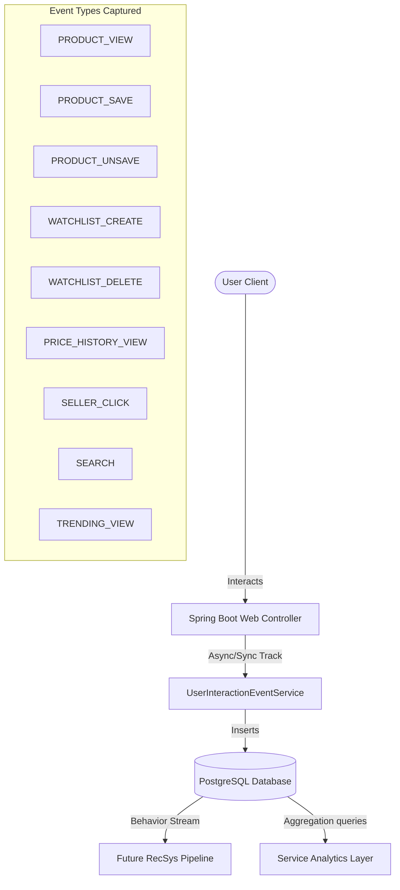
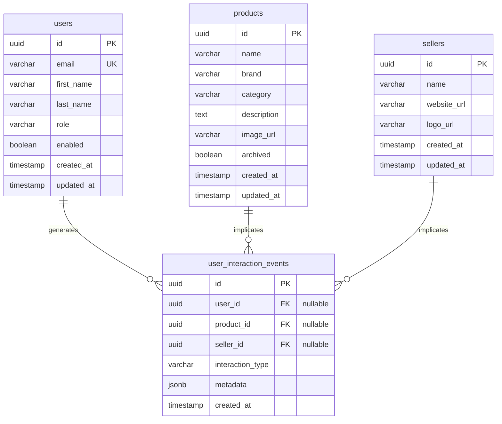

# User Interaction Event Tracking & Analytics Architecture
**Author:** Principal Backend Engineer & Data Platform Architect  
**Project:** PricePilot  
**Status:** Implemented & Production Ready

---

## 1. Architectural Overview

The **User Interaction Event** system records granular, individual user behavior actions. Rather than simple aggregate counts (e.g., total views), it stores immutable historical events. This provides a rich behavioral stream that serves as the foundation for:
1. **User Personalization:** Reconstructing individual user journeys.
2. **Behavioral Analytics:** Fetching platform usage insights (active users, popular brands, category interest).
3. **Recommendation Systems (Future AI):** Running collaborative filtering, similarity matrix computations, and seller preference analytics.



---

## 2. ER Diagram & Database Schema Updates

The `user_interaction_events` table represents an append-only event log. It contains foreign keys referencing core entities and a flexible `metadata` JSONB column for event-specific attributes.

### ER Diagram



### Table Indexes for Query Optimization
To optimize search, timeline rendering, and real-time analytics aggregation, the following indexes are applied:
*   `idx_user_interaction_events_user_id`: Optimizes dashboard timeline queries for individual users (`GET /events/me`).
*   `idx_user_interaction_events_product_id`: Optimizes product-specific behavioral lookups (`GET /events/products/{id}`).
*   `idx_user_interaction_events_seller_id`: Optimizes seller popularity lookups.
*   `idx_user_interaction_events_type_created`: Optimized index on `(interaction_type, created_at DESC)` for filtering specific events within temporal windows.
*   `idx_user_interaction_events_created_at`: For default sort sorting and date range queries.

---

## 3. Event Lifecycle

```
[User Action] ---> [Web Endpoint] ---> [Event Logging (Service)] ---> [Tx Commit] ---> [Read Pipeline]
```

1.  **Action Initiation:** The user performs an action on the client (e.g., typing a search, opening a product page, saving an item, clicking out to a seller).
2.  **API Handler Execution:**
    *   For inline actions (e.g., Search, Product Details), the controller resolves the transaction normally, gets the results, and invokes `UserInteractionEventService.trackEvent`.
    *   For client-only actions (e.g., clicking external links like "Go to Amazon"), the client makes a `POST /api/v1/events/seller-click/{priceId}` API call, capturing user context (JWT) before redirecting.
3.  **Entity Resolution:** The service resolves the associated user, product, or seller proxies. If no user context exists (anonymous visitor), the event is recorded with a `NULL` user reference.
4.  **Metadata Injection:** Event-specific attributes are packaged into a JSONB structure:
    *   **SEARCH:** keyword, active filters (brand, category), resultCount.
    *   **SELLER_CLICK:** product, seller, destinationUrl, timestamp.
    *   **WATCHLIST_CREATE:** targetPrice, currentBestPrice, productName.
5.  **Database Commit:** The record is inserted with `createdAt = LocalDateTime.now()`. Since it is immutable, no updates or deletes are ever exposed.

---

## 4. Behavioral Analytics Specifications

The analytics layer runs directly in SQL via highly-efficient JPQL/native aggregation queries. This enables real-time service analysis:

*   **Most Viewed Categories:** Identifies which categories receive the highest density of `PRODUCT_VIEW` events.
*   **Most Viewed Brands:** Ranks product brands based on total user views.
*   **Most Active Users:** Tracks which user accounts generate the most events (essential for locating power-users or crawlers).
*   **Most Clicked Sellers:** Computes the click-through rates (CTR) to sellers, indicating merchant traction.
*   **Most Searched Keywords:** Extracts the `'keyword'` path inside the `metadata` JSONB block using PostgreSQL native functions to rank user search intent.

---

## 5. Future AI & Recommendation Pipeline Design

To prepare PricePilot for ML models and personalized search assistants, the event stream is designed to support the following analytical vector mappings.

### Machine Learning Vector Mappings

#### A. Users Similar to X (User-User Collaborative Filtering)
*   **Mathematical Concept:** Cosine Similarity of interaction vectors.
*   **Data Representation:** Construct a User-Product Interaction Matrix ($R_{m \times n}$) where cell values reflect interaction strength (e.g., Product View = 1, Save = 3, Watchlist Create = 5).
*   **SQL Extract:**
    ```sql
    SELECT user_id, product_id, 
           SUM(CASE 
             WHEN interaction_type = 'PRODUCT_VIEW' THEN 1
             WHEN interaction_type = 'PRODUCT_SAVE' THEN 3
             WHEN interaction_type = 'WATCHLIST_CREATE' THEN 5
             ELSE 0 
           END) as interaction_weight
    FROM user_interaction_events
    WHERE user_id IS NOT NULL AND product_id IS NOT NULL
    GROUP BY user_id, product_id;
    ```
*   **ML Pipeline Pipeline:** Push this matrix to an offline training job (e.g., running Matrix Factorization via ALS in Spark, or PyTorch Collaborative Filtering) to determine user embeddings. Similiar users are computed via:
    $$\text{Similarity}(u_1, u_2) = \frac{\vec{u}_1 \cdot \vec{u}_2}{\|\vec{u}_1\| \|\vec{u}_2\|}$$

#### B. Products Frequently Viewed Together (Item-Item Co-occurrence)
*   **Mathematical Concept:** Association Rule Mining (Support, Confidence, Lift).
*   **Data Representation:** A session-based co-occurrence matrix. A session is defined as a temporal window (e.g., 30 minutes) of events for a single user.
*   **SQL Extract (Co-occurrence within 30-min window):**
    ```sql
    SELECT e1.product_id AS product_a, e2.product_id AS product_b, COUNT(*) AS pair_count
    FROM user_interaction_events e1
    JOIN user_interaction_events e2 ON e1.user_id = e2.user_id 
        AND e1.product_id < e2.product_id
        AND e2.created_at BETWEEN e1.created_at AND e1.created_at + INTERVAL '30 minutes'
    WHERE e1.interaction_type = 'PRODUCT_VIEW' AND e2.interaction_type = 'PRODUCT_VIEW'
    GROUP BY e1.product_id, e2.product_id
    ORDER BY pair_count DESC;
    ```
*   **Usage:** Powers "Frequently Bought Together" or "Customers Who Viewed This Also Viewed" widgets on product detail pages.

#### C. Users Interested in Apple Products (Brand Preference Vectors)
*   **Concept:** Direct brand preference index.
*   **SQL Extract:**
    ```sql
    SELECT e.user_id, COUNT(e.id) as brand_interactions
    FROM user_interaction_events e
    JOIN products p ON e.product_id = p.id
    WHERE p.brand = 'Apple' AND e.user_id IS NOT NULL
    GROUP BY e.user_id
    ORDER BY brand_interactions DESC;
    ```
*   **Usage:** Enables targeted marketing campaigns or personalized recommendations for a specific brand when a user returns to the catalog.

#### D. Most Searched Laptop Brands (Intent Analysis)
*   **Concept:** Context-based search term parsing.
*   **SQL Extract:**
    ```sql
    SELECT jsonb_extract_path_text(metadata, 'filters', 'brand') as brand, COUNT(*) as search_count
    FROM user_interaction_events
    WHERE interaction_type = 'SEARCH' 
      AND lower(jsonb_extract_path_text(metadata, 'keyword')) LIKE '%laptop%'
      AND jsonb_extract_path_text(metadata, 'filters', 'brand') IS NOT NULL
    GROUP BY brand
    ORDER BY search_count DESC;
    ```

#### E. Seller Preference by User (Merchant Affiliation Model)
*   **Concept:** Predicts whether a user favors Amazon vs. Flipkart/Walmart.
*   **SQL Extract:**
    ```sql
    SELECT user_id, seller_id, COUNT(id) as clicks
    FROM user_interaction_events
    WHERE interaction_type = 'SELLER_CLICK' AND user_id IS NOT NULL
    GROUP BY user_id, seller_id;
    ```
*   **Usage:** When returning prices, we can highlight or bubble up the user's preferred merchant to boost CTR.

---

## 6. Performance & Scaling Considerations

To maintain sub-millisecond API response times as event counts grow into the millions:
1.  **Read-Write Separation:** The event tables should ideally be replicated to a read-only PostgreSQL instance, where offline analytics scripts, python AI recommendation engines, and reports run without locking the main transactional database.
2.  **Database Partitioning:** Range-partitioning the `user_interaction_events` table by `created_at` monthly ensures that old data can be easily archived or deleted, and queries targeting recent timelines run only against current partitions.
3.  **Indexing Overhead:** Since the table is write-heavy and append-only, index count should be minimal. We have optimized indexes for FKs and search/filter paths only.
