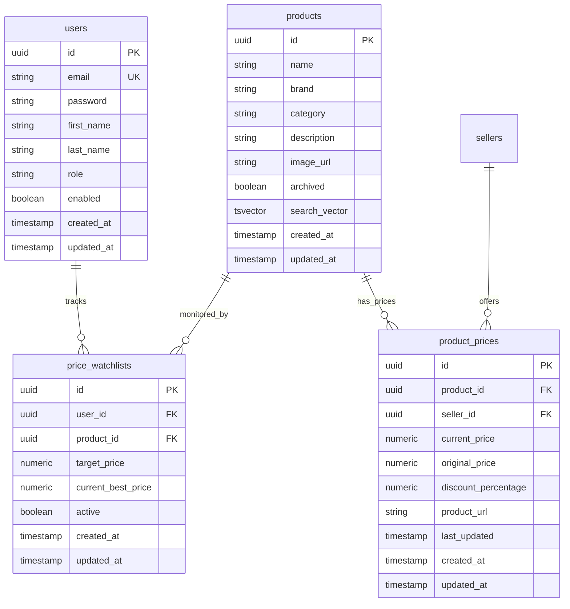
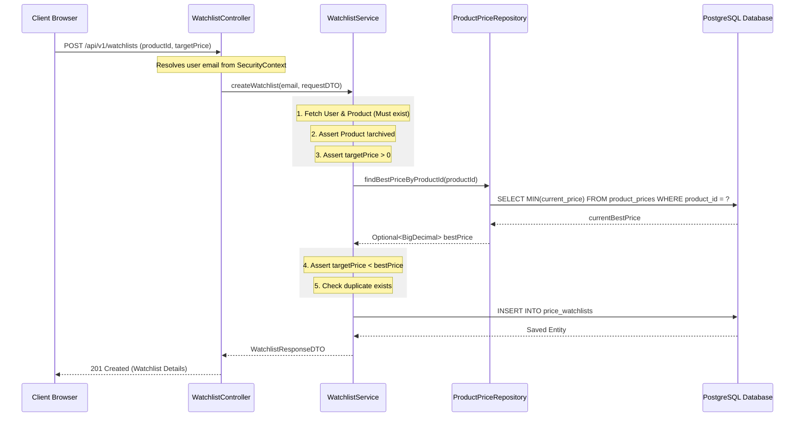
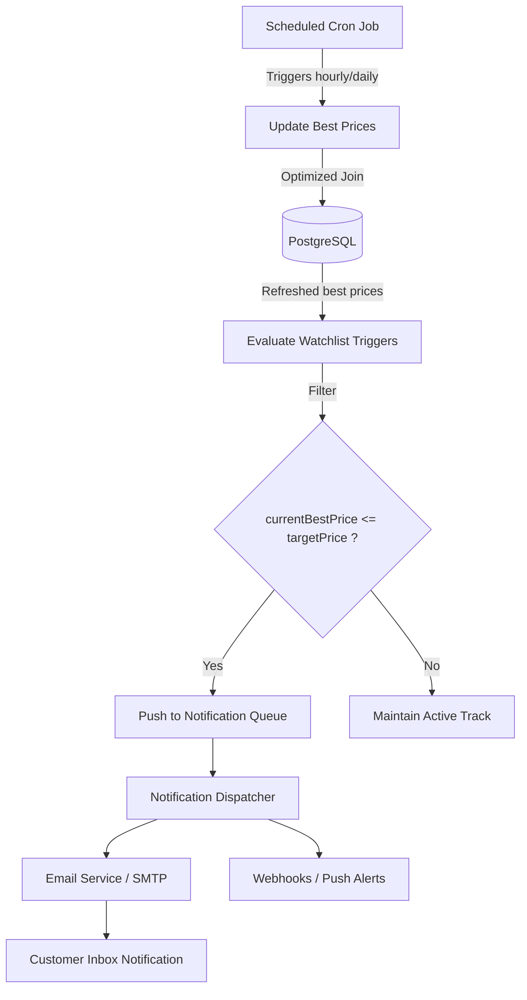

# Price Watchlist System Architecture Document

This document provides a comprehensive overview of the design and implementation of the **Price Watchlist** feature in the PricePilot platform.

---

## 1. ER Diagram Updates

The `price_watchlists` table acts as a relational link mapping users to products with price tracking thresholds. It is designed to scale efficiently and enforces data integrity at the database level.

### Database Relation Schema (Mermaid)



### DDL Schema (SQL representation)

```sql
CREATE TABLE price_watchlists (
    id UUID NOT NULL PRIMARY KEY,
    user_id UUID NOT NULL,
    product_id UUID NOT NULL,
    target_price NUMERIC(10, 2) NOT NULL,
    current_best_price NUMERIC(10, 2) NOT NULL,
    active BOOLEAN NOT NULL DEFAULT TRUE,
    created_at TIMESTAMP(6) NOT NULL,
    updated_at TIMESTAMP(6) NOT NULL,
    
    CONSTRAINT fk_price_watchlists_user FOREIGN KEY (user_id) REFERENCES users(id) ON DELETE CASCADE,
    CONSTRAINT fk_price_watchlists_product FOREIGN KEY (product_id) REFERENCES products(id) ON DELETE CASCADE,
    CONSTRAINT uc_price_watchlists_user_product UNIQUE (user_id, product_id)
);

CREATE INDEX idx_price_watchlists_user_id ON price_watchlists(user_id);
CREATE INDEX idx_price_watchlists_product_id ON price_watchlists(product_id);
```

> [!NOTE]
> - The unique constraint `uc_price_watchlists_user_product` prevents a user from creating duplicate watchlist entries for the same product.
> - Indexes on foreign keys (`user_id`, `product_id`) guarantee sub-millisecond query performance on joins.

---

## 2. Watchlist Architecture Document

The system implements a decoupled, testable multi-tiered architecture using Spring Boot (Backend) and React (Frontend).

### System Component Flow



### Components Description

1. **[PriceWatchlistEntity.java](file:///D:/PricePilot/backend/src/main/java/com/pricepilot/watchlist/PriceWatchlistEntity.java)**: Core JPA entity mapping the table properties and tracking targets.
2. **[PriceWatchlistRepository.java](file:///D:/PricePilot/backend/src/main/java/com/pricepilot/watchlist/PriceWatchlistRepository.java)**: Interface for CRUD access. Contains optimized queries utilizing `JOIN FETCH` to eliminate N+1 query overhead when returning user lists.
3. **[PriceWatchlistService.java](file:///D:/PricePilot/backend/src/main/java/com/pricepilot/watchlist/PriceWatchlistService.java)**: Encapsulates all core validations, exception handling logic, and future price comparison matching.
4. **[PriceWatchlistController.java](file:///D:/PricePilot/backend/src/main/java/com/pricepilot/watchlist/PriceWatchlistController.java)**: REST Endpoints handler. Uses `@Valid` for syntax validation and extracts authenticated identities securely.

---

## 3. Future Notification Flow Design

To implement automated alerts when a price falls beneath the customer's target thresholds, we prepare a scheduler pipeline.

### Notification Trigger Architecture



### Service Preparation Methods

We have introduced future-ready methods inside `PriceWatchlistService.java`:
- **`getTriggeredWatchlists()`**: Retrieves all active tracker records where `currentBestPrice <= targetPrice` using an optimized mapping filter.
- **`updateBestPricesForActiveWatchlists()`**: Automatically recalibrates the `currentBestPrice` cache column on watchlist records by executing a single pooled batch select on `product_prices`.

---

## 4. Business Rule Documentation

The API endpoints enforce strict verification states.

| Rule Description | Input Checked | Exception Returned | HTTP Status Code |
| :--- | :--- | :--- | :--- |
| **Product Existence** | `productId` | `ResourceNotFoundException` | `404 Not Found` |
| **Product Active State** | `product.archived == false` | `IllegalArgumentException` | `400 Bad Request` |
| **Target Price Bounds** | `targetPrice > 0` | `@DecimalMin` / `IllegalArgumentException` | `400 Bad Request` |
| **Target Price Range** | `targetPrice < currentBestPrice` | `IllegalArgumentException` | `400 Bad Request` |
| **Duplicate Prevention** | `userId + productId` unique | `DuplicateWatchlistException` | `409 Conflict` |
| **Ownership Access Control** | `watchlist.user == auth.user` | `AccessDeniedException` | `403 Forbidden` |
| **Auth Enforcement** | Valid Bearer JWT | `BadCredentialsException` | `401 Unauthorized` |
