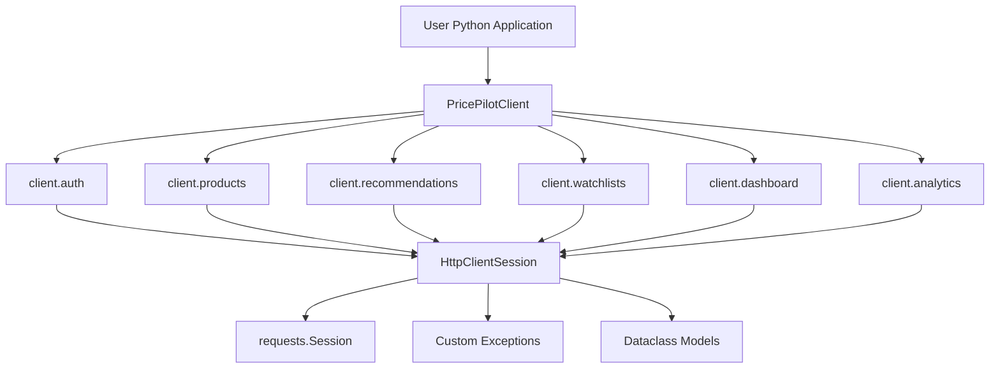

# PricePilot Python SDK

A production-quality, type-safe Python SDK for the PricePilot REST API. Suitable for use in ML pipelines, FastAPI services, Jupyter notebooks, CLI tools, and background worker services.

---

## Features

- **Clean, Modular Namespaces**: Exposes all API functionality through specialized sub-modules:
  - `client.auth` — Register, login, and session token management
  - `client.products` — Faceted search, pagination, product detail retrieval, seller registries, and price points CRUD
  - `client.recommendations` — Personalized, similar, and trending products recommendations
  - `client.watchlists` — Price drop target watchlists and product favorites management
  - `client.dashboard` — Combined summaries and user activities
  - `client.analytics` — Product view counts, save counts, and trending metrics
  - `client.ml` — Model training, offline evaluation, model metadata, and explainable predictions
- **Resilient Networking**: Automatic HTTP connection pooling, configurable timeouts, and smart retries with exponential backoff.
- **Robust Error Handling**: Standardizes backend API HTTP error statuses into a clean, typed Python exception hierarchy.
- **Fully Type-Hinted**: Clean types, signatures, and static checking compatibilities.
- **Standard Logging**: Uses Python's built-in `logging` module. Zero print statements.

---

## Installation

### From Source (Development Mode)
```bash
git clone https://github.com/jadhavaayush611/Price-Pilot.git
cd Price-Pilot/pricepilot-python-sdk
pip install -e .
```

### Development Dependencies
To install with testing and linting tools:
```bash
pip install -e .[dev]
```

---

## Quick Start

### 1. Initialization and Auth
```python
import logging
from pricepilot import PricePilotClient, ValidationError, AuthenticationError

# Enable logging
logging.basicConfig(level=logging.INFO)

# Initialize client
client = PricePilotClient(base_url="http://localhost:8080/api/v1")

try:
    # Login (stores token automatically for subsequent calls)
    auth_response = client.auth.login(email="user@example.com", password="password123")
    print(f"Logged in as {auth_response.user.first_name}")
except AuthenticationError:
    print("Invalid credentials.")
```

### 2. Product Search (Faceted & Paginated)
```python
# Faceted Search
results = client.products.search(
    keyword="headphones",
    category="Electronics",
    brand="Sony",
    page=0,
    size=10,
    sort="price-asc"
)

print(f"Found {results.total_elements} products.")
for product in results.content:
    print(f"- {product.name} | Lowest Price: ${product.lowest_price}")
```

### 3. Fetching Recommendations & Dashboard
```python
# Recommendations
recs = client.recommendations.get_recommendations(size=5)
for product in recs.content:
    print(f"Personalized Pick: {product.name}")

# Dashboard Data
dashboard = client.dashboard.get_dashboard_data()
print(f"Total Watchlists: {dashboard.watchlist_count}")
print(f"Active Price Alerts: {dashboard.active_price_alerts_count}")
```

### 4. Watchlist Management (CRUD)
```python
# Save a product to favorites
client.watchlists.save_product(product_id="8b4c5d6e-7f8a-9b0c-1d2e-3f4a5b6c7d8e")

# Add a price alert trigger
alert = client.watchlists.create_watchlist_item(
    product_id="8b4c5d6e-7f8a-9b0c-1d2e-3f4a5b6c7d8e",
    target_price=299.99
)
print(f"Watchlist alert created with ID: {alert.id}")
```

### 5. Machine Learning Operations (Model Training & Evaluation)
```python
# Trigger pipeline training for a dataset version
report = client.ml.train(dataset_version="1.0.0", k=10)
print(f"Model trained at: {report['trainedAt']}")

# Fetch model metadata for the Hybrid recommender
metadata = client.ml.model_metadata(algorithm="Hybrid")
print(f"Precision@10: {metadata['precisionAtK']:.4f}")

# Generate predictions using the Collaborative filtering recommender
predictions = client.ml.predict(algorithm="Collaborative", user_id="8b4c5d6e-7f8a-9b0c-1d2e-3f4a5b6c7d8e", limit=5)
for pred in predictions:
    print(f"Product: {pred['name']} | Algorithm: {pred['recommendationAlgorithm']}")
    print(f"Reasons: {', '.join(pred['recommendationReasons'])}")
```

---

## Package Architecture Overview



- **`PricePilotClient`**: The primary coordinator class. Users only need to instantiate this.
- **`HttpClientSession`**: A wrapper around `requests.Session` that manages the active JWT bearer token, base URLs, SSL configurations, timeouts, retries, and transforms raw responses into models or exceptions.
- **`exceptions.py`**: Defines custom SDK error classes:
  - `PricePilotError` (Base exception)
  - `ValidationError` (Input/constraint errors; maps 400/422 status codes)
  - `AuthenticationError` (Auth failures; maps 401/403 status codes)
  - `NotFoundError` (Missing resource; maps 404 status codes)
  - `ApiError` (Backend failures; maps other HTTP statuses)

---

## Running Tests

Verify your installation by running tests:
```bash
pytest tests/
```
